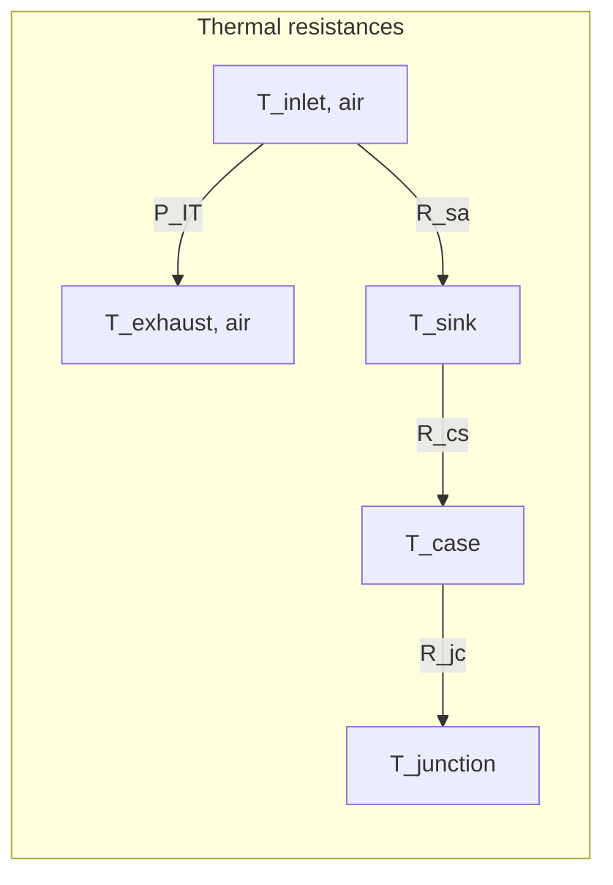

% ===========================================================================
\part{Presentation of the modules}
% ===========================================================================


When we face modelling choices we usually have two paradigms:

Model physically the sub-system your are studying
- requires exogenous standardized parameters
- work with assumption of ideality, physic models
- equations should be inceasingly complex to grasp real behavior of physical systems

Or use polynomial fitting of the behaviour of the sub-system.

- coefficients can give very reliable behaviour
- almost all behaviours can be reproduced by polynomial equations.
- computation is very quick (trivial multiplications and additions) 
- Highly dependent on a particular sub-system, coefficient should be recalibrated for each new sub-system.  
- Require time-series measures from a real system.
- Data should be clean, identifiable to a precise architecture and hardware models, coherent, without operating conditions or hardware changes. 

During my work in estimating flexibility capabilities of data centers via its cooling system through modelling , I faced some hardships:

- Data centers have multiple architectures depending on if they are air or liquid cooled, no standardized chain of cooling devices or hardware components for the severs, and different operating conditions in flow rates, redundancy, number of chillers, volumes of water, headrooms, etc.
- On the internet, there is no consistent time series data measurements. (cf. Part III "Data research")
- For parameters, specifications of real devices for cooling systems and servers are findable on the internet but are scarce.


Because of this the values of the model are presented wihin an interval. This interval can mean two very different this:
- variability between models. Becasue we don't know which systems are present in data centers, the statistical approach will replicate the variability of the different hardwares and thir sizes.
- variability during operation . This are the degrees of freedom the cooling system has, that allow flexibility and power consumtion reduction.

Structure:

We have modular blocs with functions independent of the other blocs and we have connexions between these blocs. The interface between two modules is composed of the flow rates and the temperatures. The sizing method of my modelling focuses on these interfaces. 

# Basic concepts

## Heat exchanger / NTU model

This modelling is found in thermal transfers inside : 
- the cooling tower
- crac units
- server

Each one of these systems have their own specificities, so equations are still different but stem from the same model.


# Flexibility parameters:

Reservoir


Flow rates no. 


# Chiller

The chiller is the main source of electricity consumption. It is a central piece of the cooling system using a refrigerant loop with: 
- a compressor, 
- an expansion valve 
- an evaporator
- a condenser

## Equations

### Water cooled
$
T_{evap, out} = T_{setpoint} $[1]

$Q_{demand} =  D_{evap} c_{p, w} \rho_w (T_{evap, in} - T_{evap, out} ) $

$PLR = \frac{Q_{demand}}{Q_{rated}} $

$EIR(PL) = a_0 + a_1 PLR + a_2 PLR^2 $

$COP_{ref} = COP(PLR = 1)$
$
COP = \frac{COP_{ref}}{EIR(PLR)} $[2]  \cite{COP_ASHRAE}
$
T_{cond, out} = T_{cond, in} + (1 + \frac{1}{COP})\frac{ D_{evap}}{ D_{cond}} ( T_{evap, in} - T_{evap, out} )$ [3]

### Air cooled 


$$
T_{evap, out} = T_{setpoint} 


T_{air, out} = T_{air, in} + (1 + \frac{1}{COP}) \frac{D_{evap} \rho_w c_{p, w}}{D_{outside, air}\rho_air c_{p, air}} ( T_{evap, in} - T_{evap, out} ) 
$$

## Assumptions
[1]
- Perfect setpoint tracking, control asssumption

[2]
- Single-chiller, no plant-level interaction effects (sequencing, staging losses between multiple chillers are not captured)
- Quasi-steady-state at each PLR — no transient/startup effects

[3]
- Steady-state energy balance — no thermal mass/capacitance in the chiller (no transient charging/discharging of refrigerant or metal mass).
- Both condenser and evaporator loop use pure water.
- the heat capacity and volumic mass of water are constant and don't depend on temperature.
- Hermetic water-cooled compressor : All compressor work ends up as heat rejected at the condenser
- No pumps heat addition, no piping heat gain/loss between chiller and measurement points.
- Chillers are working at their rated conditions
- No maximum cooling capacity

## Parameters

$
Q_{rated} # in tons 
COP_{ref}   # adim
(a_0, a_1, a_2) : empirical curve fitting parameters

D_{evap}
D_{cond}
T_{setpoint}

$

## Values for water cooled chillers

$
1 nominal ton of refrigeration = 3.517 kW cooling output
 COP = 3.517 / (kW/ton)
Q_{rated}  \in [150, 4000] tons = [530, 14100] kW \cite{AHRI_Directory}, \cite{FriendlyPower} (cf. Nominal cooling capacity)

Aquaforce model 30XW-V:
Q_{rated} \in [567, 1432] kW \cite{AQUAFORCE}

COP_{ref}  \in [0.54, 0.64] kW/ton => [5.5, 6.5] adim \cite{Trane_chiller_ex}, \cite{AQUAFORCE} (page 9), \cite{FriendlyPower} 

(0,1,0) \cite{EnergyPlus_COP}

 (0.171, 0.588, 0.237) \cite{COP_params}
 (0.223, 0.313, 0.464)
 (0.064, 0.585, 0.353)
$

These are considered the default parameters for a water cooled chiller

After more research, there is EnergyPlus with a bit less than 300 chiller models, air and water cooled collected over a 10-year period from 1991 to 2001. \cite{EnergyPlus_Git}

We can confirm good consistency between the default parameters and the statistical analysis of the EnergyPlus data for water-cooled chillers. However, the default interval of cooling capacity underestimates the maximum cooling capacity for a factor 4. 

Note: For my modelling, I erased two models (DOE...) because no reference_capacity_kW was specified (null).

### EnergyPlus data, statistical analyzis

### Characterisation of the EnergyPlus chiller dataset

Before using the chiller models for further analysis, the content of the EnergyPlus `Chillers.idf` dataset was examined in order to understand the range and nature of the equipment represented. The file contains a total of **273 chiller models**, of which **162 are water-cooled** and **111 are air-cooled**, corresponding to approximately 59% and 41% of the dataset, respectively. The following analysis considers the compressor technologies represented in each group, as well as the distributions of reference cooling capacity and reference coefficient of performance (COP).

#### Compressor technologies

The water-cooled chillers are dominated by **centrifugal compressors**, which account for **110 of the 162 models (67.9%)**. Screw compressors represent a substantially smaller fraction, with **21 models (13.0%)**, while only one reciprocating and one scroll chiller are present. For **29 water-cooled chillers (17.9%)**, the compressor type could not be identified from the available metadata and was therefore classified as unknown. This distribution indicates that the water-cooled portion of the dataset is primarily representative of centrifugal chiller technology, which is consistent with the larger cooling capacities typically associated with this type of equipment.

The air-cooled chillers exhibit a markedly different technological distribution. Of the **111 air-cooled models**, **92 (82.9%) use scroll compressors**, while the remaining **19 (17.1%) use screw compressors**. No centrifugal or reciprocating compressor models are represented in this subset. The distinction between the two groups is therefore quite pronounced: the air-cooled database is largely composed of scroll chillers, whereas the water-cooled database is dominated by centrifugal machines.

#### Reference cooling capacity

The reference cooling capacities also show a substantial difference between the two condenser types. For the water-cooled chillers, **160 models contain a valid reference cooling capacity**, with values ranging from **172.3 kW to 5651.3 kW**, giving an overall span of **5479 kW**. The models therefore cover equipment ranging from relatively small water-cooled units to multi-megawatt chillers. To assess how continuously this capacity range is represented, the capacities were sorted in ascending order and the differences between consecutive values were calculated. The largest gap is **854.5 kW**, occurring between **3165.0 kW** and **4019.5 kW**, corresponding respectively to the *McQuay PFH 3165 kW/6.48 COP/Vanes* and *McQuay PFH 4020 kW/7.35 COP/Vanes* models. Thus, although the water-cooled dataset covers a very broad capacity range, the representation becomes relatively sparse in some parts of the high-capacity region.

All **111 air-cooled chillers** contain valid capacity information. Their reference capacities range from **34.465 kW to 1609.4 kW**, corresponding to an overall span of approximately **1575 kW**. The largest interval between two consecutive capacities is considerably smaller than for the water-cooled chillers, at **151.5 kW**, between the **1348.0 kW Carrier 30XA400** and the **1499.5 kW Carrier 30XA450**. The air-cooled models therefore occupy a narrower and generally lower capacity range, while also providing a relatively denser coverage of that range.

#### Reference COP

The reference COP values further differentiate the two groups. For the **162 water-cooled chillers**, the reference COP ranges from **3.67 to 11.77**, resulting in a total span of **8.10**. After sorting the COP values, the largest gap between consecutive observations is **1.16**, between COP values of **10.61** and **11.77**. These values correspond to the *York YT 563 kW/10.61 COP/Vanes* and *Trane CVHF 2567 kW/11.77 COP/VSD* models. The broad COP range reflects the diversity of water-cooled equipment represented in the file, including different capacities, compressor technologies and capacity-control strategies.

By contrast, the COP values of the air-cooled chillers are concentrated within a much narrower interval. Across all **111 models**, the reference COP ranges from **2.61 to 3.17**, for a total span of only **0.56**. The largest gap between consecutive COP values is **0.13**, between **2.67 and 2.80**. Consequently, the air-cooled models form a relatively homogeneous group in terms of reference efficiency compared with the much wider variation observed among the water-cooled chillers.

#### Overall dataset coverage

Overall, this preliminary examination shows that `Chillers.idf` does not represent a uniform population of chillers. The air-cooled subset is primarily composed of scroll-compressor equipment, covers capacities from roughly **35 kW to 1.6 MW**, and exhibits a relatively narrow range of reference COP values. The water-cooled subset is considerably broader, both in capacity and performance, extending from approximately **170 kW to 5.7 MW** and being dominated by centrifugal compressors. Examining the minimum and maximum values together with the gaps between consecutive observations is particularly useful because it provides information not only on the nominal extent of the dataset, but also on how densely the different operating regions are represented. These characteristics should therefore be taken into account when selecting models from the EnergyPlus database or when using the dataset to construct a representative chiller population.


### Choice of parameters: 

Q_rated and COP_ref (full-load COP) are certified, published value under the standard:\cite{Standard_AHRI550}. Furthermore their situation reference is standardized in temperatures leaving and entering. 

Both numbers come from the exact same test and the exact same standard rating conditions : 44.00°F leaving and 54.00°F entering chilled-fluid temperatures, with 85.00°F entering and 94.30°F leaving condenser-fluid temperatures for water-cooled units. So Q_rated and COP_ref are a matched pair, both certified together, both published on the same spec sheet / AHRI certificate.

## Validity domain

[1]
- Only valid if T_evap,out actually reaches setpoint — under extreme load or insufficient capacity this fails silently (the equation will overstate cooling delivered).

[2]
- Only valid for PLR above 0.1-0.3 and below 1. If the PLR is too low the chiller cycles on/off rather than modulating. (DOE-2 style models)
- Only valid near rated/AHRI-standard temperature conditions


- Parameters spread from each other within [5.0, 6.2] for PLR above 40 percent. Below, the discrepancies increase.

[3]
- Only valid while the chiller is running and stable — not during startup, shutdown, or hot-gas bypass/unloading transients.


- The set of (Q_{rated}, COP_{ref}) parameters are taken for Centrifugal Chillers.
## Confidence interval


[2]
- On COP, for a given set of fitting parameters, the induced error is 10-15% at PLR > 50%, 20-25% at PLR < 50% 

[3]

$ 
\frac{\partial T_{cond,out}}{\partial COP} = −\frac{D_{evap}( T_{evap, in} - T_{evap, out} ) }{ D_{cond} COP^2} $

With COP carries a relative uncertainty $ \epsilon = \frac{\partial COP}{COP} $ we can then propagate the error to the temperature :

$ \delta T_{cond,out} = \epsilon \frac{D_{evap}( T_{evap, in} - T_{evap, out} ) }{ D_{cond} COP} $

With numerical values we get a maximum: $\delta T_{cond,out} = \pm 0.1 C$


# Interface Chiller - CRACs 

## Volume

### On WUE

WUe for Water usage efficency is a measyre that gives, flow rate of water consummed per W of It power. However the water consumed is mainly water evaporated no water cirulating in pipes in the cooling system. Main contrubitions to the WUe are the evaporation in the Cooling towers (2-3 % of the volume)
This data is not usefull for sizing the volume of water in a data center.

### Values

A rule of thumb to size the volume of the evaporator loop of the chiller is : 10 gallons per ton cooling Q_{rated} \cite{Redriver_tanks} ("The most widely used rule of thumb is 10 gallons per ton of installed chiller capacity")

## Flow rates

### Values: 
the standard measurement for a chiller is given by: "test conditions of 44°F (7°C) leaving chilled-water temperature and 2.4 gpm/ton evaporator fluid flow and 85°F (29°C) entering condenser water temperature with 3 gpm/ton (0.054 I/s • kW) condenser water flow " \cite{Standard_C403}

So taking the min and max of $ Q_{rated}$:

- $D_{evap,nominal} \in [23, 605] 
$L/s
- $D_{cond,nominal} \in [28, 756] $l/s


Which is coherent with: Operating range for Chiller \cite{AQUAFORCE} (page 9)
Here the variability depends on the model (30XW-V 160 to 400 with a perfect correlation between Capacity and flow rate).
$D_{evap} \in [24, 62] L/s
D_{cond} \in [30, 76] L/s
$
### Variability within a specific chiller. 
$
D_{evap} \in [0.40, 1] * D_{evap,nominal} \cite{Variable_FR}. I wasn t able to find an upper bound of the evaporator flow rate. So it is rasonable to leave it at 1. 

$
For a standard chiller, chilled water flow rate change should not exceed roughly 2% within any 10-minute window, to avoid destabilizing the compressor's surge-avoidance controls. \cite{Variable_FR}
Therefore, this makes the flow rate an almost fixed parameter. 


## Temperatures

### Values
operating range for Chiller \cite{AQUAFORCE} (page 3)
$
T_{evap, out} \in [3.3,20] C
T_{evap, in} \in [6.1,31.1] C (\Delta T_{evap} \in [2.8, 11.1] C)
T_{cond, out} \in [19,50] C
T_{cond, in} \in [16.2,38.9] C (\Delta T_{cond} \in [2.8, 11.1] C)
$

T_{setpoint} is for air-cooled facilities typically set at (42-44 F) = (6-7 C). However optimization push data centers to increase the setpoint temperature of the chilled water (10 C - 18 C). \cite{Uptime_cooling} (see: "Typical legacy data centers have chilled water set points between 42-45°F (6-7°C)")$

# Cooling Tower

$$\begin{cases}

k
\epsilon = \frac{T_{w, in} - T_{w, out}}{T_{w, in} - T_{wb}} \cite{Merkel} \\

\end{cases}$$


## Parameters

$
D_{outside, air} 
D_{cond}

\epsilon = \epsilon_{calibr}

T_{w, out, calibr}, T_{w, in, calibr}, T_{wb, calibr}

$

## Values
Normalized operating point for all documentations thanks to \cite{Standard_AHRI550}
"Nominal tons of cooling represents 3 GPM of water cooled from 95ºF to 85ºF at a 78ºF entering wet-bulb temperature" (page 1)
$
T_{w, out, calibr} = 85 F
T_{w, in, calibr} = 95 F = 35 C

T_{wb, calibr} = 78 F

D_{outside, air} \in  [62.8, 605] kCFM ([62.8, 302]  for single Cell and [126, 605] for Double Cell \cite{Series3000CoolingT} (pages 1-2))k

D_{outside, air} \in  [5.0,  291] kCFM  \cite{SeriesVCoolingT} (pages 1-6)

D_{outside, air} \in  [9.6,  995] kCFM \cite{Evapco} (page 3, 76) 

D_{cond, nom} = 3 * [12, 1330] GPM = [36, 4000] GPM =  \cite{SeriesVCoolingT} (pages 1-6)

D_{cond, nom} = 3 * [240, 2600] GPM = [720, 7800] GPM =  ([240, 1300] for single Cell and [480, 2600] for Double Cell \cite{Series3000CoolingT}
 )
D_{cond, nom} = 3 * [33, 5080] GPM = [99, 15160] GPM =  \cite{Evapco} (pages 1-6)


Summary :
D_{outside, air} \in  [5.0,  995] kCFM = [2.4, 470] m3/s
D_{cond, nom} \in  [36, 15160] GPM = [2.3, 957] L/s

Q_{nom} = 10 * 5/9 * 4.190 * D_{cond, nom}       # kW
Q_{nom} \in [53.5, 22.3 * 10 **3] kW

$

Cooling towers can take a wide range of different values (air flow rates, cooling capacity) because the number of cells can easily scale with the demand during cooling system sizing. We consider we can have an operating efficiency = nominal efficiency independenlty of condenser flow rate.
## Assumptions

-   Counterflow configuration.
-   Lewis number = 1 (heat and mass transfer analogy holds — same assumption as Merkel).
-   The enthalpy driving force is treated exactly like a temperature driving force in a conventional sensible heat exchanger — i.e., the "air-side capacity rate" is replaced by G⋅CsG \\cdot C\_s G⋅Cs​ rather than G⋅cpaG \\cdot c\_{pa} G⋅cpa​.
-   C_s​ (and therefore m^* ) is constant over the exchanger — approximated via a linearization of the true (curved) saturation enthalpy line between inlet and outlet water conditions.
-   Steady-state, no wall/casing heat losses, uniform air and water distribution across the fill cross-section.
- Because we are staying close to the operating point that depends on both air and water flows we assume that the Cooling tower works near its rated flow rates.
- We study steady-state operation, no transient storgae effects.
- Dry air and water vapor are each treated as ideal gases (Dalton's law of partial pressures for the mixture) 
- Heat capacity for water vaoupr is supposed to be constant.
- h_{fg​} is referenced to 0°C and treated as behaving linearly with the c_{pv}(T).
- [5] empirical curve, standard atmospheric composition at sea level.

## Method
$

The standard modus operandi for Cooling Tower constructors is to give one operating point (T_{w, out, calibr}, T_{w, in, calibr}, T_{wb, calibr}) and specify the airflow coming inside the cooling tower D_{outside, air}.

First we find \epsilon and  m*(T_{operatingPoint}) using formulas for C_s(T_{operatingPoint}) then D_{cond} and the given D_{outside, air}. Then we compute NTU_{calibr} = \frac{ln(\frac{1−ε}{1−m∗ε}​)​}{m∗−1}.

And we have the function \epsilon_{calibr}(T_{wb} ) 

From this we can now compute T_{w, out} using this : 

T_{w, out} = T_{wb} - \epsilon_{calibr}( T_{w, in} - T_{wb} ) 

With \epsilon_{calibr} independent of flow rates (assumption) and dependent of T_{wb} and T_{w, out}. 

\epsilon contains a non closed-form since C_s(T_{w, in}, T_{w, out}) depends on T_{w, out}. We can either do a loop for convergence or use the T_{w, out} at time t - dt. To reduce complexity the second option will be prefered.

$

# Interface CoolingT - Chiller

## Sizing

$ Q_{coolingCapacity}^{CoolingT} = (1+ \frac{1}{COP(PLR = 1)})* Q_{coolingCapacity}^{Chiller} $

Be carefull that the nominal tons are defined differently for Cooling towers and Chillers: 3 GPM cooled 10°F of water versus 2.4 GPM GPM cooled 10°F of water.

# OutdoorEnvironment

The outdoor environment is an essential component in the model that allows exhaustion. 


This class has two attributes: the dry-bulb temperature $T_{db}$ in degrees Celsius, and a relative humidity $ RH$ in percentage to compute the wet-bulb temperature $T_{wb}$ in degrees Celsius.

##  wet-bulb temperature
Finding the wet-bulb temperature is non trivial. \cite{ASHRAE_handbook}

In fact, wet-bulb temperature is found by equalizing the Humidity ratio from vapor pressure and the implicit dry-bulb / wet-bulb relationship. Because the Humidity ratio depends nonlinearly on $ T_wb$ (via the saturation vapor pressure curve, e.g. Hyland-Wexler), we need to iterate on these equations until convergence.


Its main equation \cite{Stull} is:

$$
        T_{wb} = T_{db} arctan(0.151977 \sqrt{RH + 8.313659}
               + arctan(T_{db} + RH)
               - arctan(RH - 1.676331)
               + 0.00391838 (RH)^{1.5}arctan(0.023101 RH)
               - 4.686035)
$$

arctan() function uses argument values in radians. 


### Choice of the equation

This equation is an empirical fit from an original psychrometric graph giving $ T_{wb} $ from $T_{wb}$ and relative humidity at standardized pressure (sea level) $P = 101.325 kPa $. 


The choice of this empirical expression stands for three reasons: 
\begin{itemize}
\item The only inputs of this expression are RH and $ T_{db}$ which are highly accessible and standardized data collected by any cooling system. 
\item The vast majority of Data center in Australia are located in latitudes with temperatures within the interval - 20 C and 50 C, and altitudes relatively close to sea level (Sydney, Melbourne). So the sea-level pressure is consistent with the scope of this work.
\item The output temperatures of this equation are very good approximations of the exact temperature, enough for our use in the Cooling Tower equation. With a fixed confidence interval of $[- 1 C; 0.65 C] $, and mean absolute error of less than 0.3 C.
\end{itemize}


Despite of the posibility to use an exact psychrometric inversion equation derived from physics models, or read psychrometric tables for given pressures, we prefer the simplified Stull model because these methods require the pressure (or altitude) at the Data Center location as another input which adds complexity to the model, and require a heavier code with dozens of iterations at each timestamp to approximate $ T_{wb}$ .


### Parameters justification and confidence interval

Parameters were given in the paper \cite{Stull} .

According to it, the output $T_{wb}$ for our model can be in the confidence interval: $ [ T_{wb} - 1 ; T_{wb} + 0.65 ]$ degrees Celsius.

### Validity

According to the abstract of the paper: "This equation is valid for relative humidity between 0.05 and 0.99 and for air temperatures between - 20 C and 50 C, except for situations having both low humidity and cold temperature. Over the valid range, errors in wet-bulb temperature range from - 1 C to 0.65 C, with mean absolute error of less than 0.3 C." \cite{Stull} 

The Stull equation is "not based on physical principles."(2. Empirical expression for wet-bulb temperature) \cite{Stull} and is only valid for pressure at sea level. 

Therefore, if the model is estimating flexibility for a Data Center at a given altitude $\Delta h_{DataCenter}$, the pressure can make the wet-bulb temperature vary more than the previously mentionned confidence interval. It is then important to evaluate the discrepancy between Stull's simplified model and the exact equation.

Using the Barometric Formula "valid from sea level to 86 km altitude" to link altitude and pressure :

$$
p = P_0 \left[ \frac{T_0}{T_0 + L \Delta h_{DataCenter}} \right] ^{\frac{gM}{RL}}
$$

Where:

$p$ = air pressure at altitude 
$p_0$ = air pressure at sea level (approximately 101325 Pa)
$L$ = temperature lapse rate (approximately 0.0065 K/m in the troposphere)
$T_0$ = standard temperature at sea level (approximately 288.15 K)
$g$ = acceleration due to gravity (approximately 9.80665 m/s²)
$M$ = molar mass of Earth's air (approximately 0.0289644 kg/mol)
$R$ = universal gas constant (approximately 8.31432 J/(mol·K))
$\Delta h_{DataCenter}$ = altitude of Data Center above sea level in meters

\cite{Barometric_formula}

Then, compute the exact equation of $T_{wb}(p)$ with the dynamic non closing algorithm and compare it to $T_{wb}(P_0)$. Either increase the confidence interval accordingly or use directly the physical equation. 


# CRAC Unit

For CRAC units, there si no rated point or cooling capacity designed. Works with a room controller. Specs usually give several operating points. Unlike chillers, CRACs have very broad operating conditions. We decide not to model the variations of water flow rates and air flows. We assume effectiveness is constant through the considered period, and we compute the effectiveness using the statistical approach: monte carlo.
$$

C_i = \rho_{i} c_{p, i} D_i

C_{min} = min(C_{w}, C_{air} ) = C_{air}

C_r = \frac{C_{air}}{C_{water}}

PowerTransfered = C_{min} \epsilon ( T_{hot, in} - T_{cold, in} ) \cite{arxiv_eq} [2]

\epsilon_{op} = \frac{Q_{op}}{C_{air,op}(T_{air, in, op} - T_{w, in, op}) }


T_{air, out} = T_{air, in} - PowerTransfered / C_{air}

T_{water, out} = T_{water, in} + PowerTransfered / C_{water}

$$
## Parameters

$
Q_{op}
D_{air,op}
T_{air, in, op} 
T_{w, in, op}
$

## Values

$ \epsilon_{op} \in [0.65 , 0.90]$

In fact, We compute : 

$\epsilon = \frac{Q_{op}}{C_{air,op}(T_{air, in, op} - T_{w, in, op}) }$

Model 305, 375, 415 \cite{Vertiv_HE} (pages 9-14)
$

(Q_{op},D_{air,op} , T_{air, in, op}, T_{w, in, op}) = 
P 9
 Model 305
(228, 16.5, 23.9, 7.2)
(276, 16.5, 26.7, 7.2)
(323, 16.5, 29.4, 7.2)
 Model 375
(267, 16.5, 23.9, 7.2)
(319, 16.5, 26.7, 7.2)
(370, 16.5, 29.4, 7.2)
 Model 415
(288, 16.5, 23.9, 7.2)
(341, 16.5, 26.7, 7.2)
(394, 16.5, 29.4, 7.2)
\epsilon \in [0.69, 0.90]
P 10
 Model 305
(214, 16.5, 23.9, 7.2)
(263, 16.5, 26.7, 7.2)
(311, 16.5, 29.4, 7.2)
 Model 375
(258, 16.5, 23.9, 7.2)
(311, 16.5, 26.7, 7.2)
(362, 16.5, 29.4, 7.2)
 Model 415
(279, 16.5, 23.9, 7.2)
(334, 16.5, 26.7, 7.2)
(387, 16.5, 29.4, 7.2)
\epsilon \in [0.65, 0.88]
P 11
 Model 305
(235, 17.2, 23.9, 7.2)
(285, 17.2, 26.7, 7.2)
(334, 17.2, 29.4, 7.2)
 Model 375
(276, 17.2, 23.9, 7.2)
(331, 17.2, 26.7, 7.2)
(384, 17.2, 29.4, 7.2)
 Model 415
(299, 17.2, 23.9, 7.2)
(355, 17.2, 26.7, 7.2)
(409, 17.2, 29.4, 7.2)
\epsilon \in [0.68, 0.89]

Summary : \epsilon \in [0.65, 0.90]

Q_{op} \in [214, 455] kW
D_{air,op} \in [35, 42] kACFM= [16.5,19.8] m^3 / s

T_{air, in, op} \in [23.9, 29.4] C
T_{w, in, op} \in 7.2 C
$


with glycol: \cite{STULZ_HE} (pages 12, 15)
$

Q_{op} \in [295, 900] kW
D_{air,op} \in [24, 90] kACFM= [11.3,42.5] m^3 / s

T_{air, in, op} \in [23.9, 34.9] C
T_{w, in, op} \in 7.2 C
$

For the link between Q_{op} and D_{air,op} is given as a rule of thumb : 350-500 CFM / ton_evap  \cite{CRAC_airflow}

this ratio matches the above values.


### Usefull Value:

$D_{water, op} \in [8, 24] L/s \cite{Vertex_HE} (pages 9-14)$

$D_{water, op} \in [6.5, 23] L/s for 6 out of the 10 models,  but extreme bounds are: [3, 48] L/s \cite{STULZ_HE} (pages 12, 15) $ 

## Assumptions
- dry coil assumption : only sensible heat transfer, no condensation dehumidifaction of the air.
- constant specific heats over the range of temperatures involved
- Counter-flow coil
- no heat loss to ambient air
- Uniform, well-mixed inlet temperatures at each port (no stratification at the coil face)
- No fan/pump motor heat pickup is included in the air-side enthalpy rise

- No significant variation of the air flow rate. Working state close to the nominal conditions. 

- Because of the difference of cooling capacity between air and water, $\frac{c_{p, air} \rho_{air}}{c_{p, w} \rho_w} \sim 8. 10^{-4} $ we assume that the limiting cooling capacity is the air. $C_{min} = C_{air}$

- For parameters, the air flow rate is given in ACFM (Actual cubic feet per minute) \cite{Wiki_ACFM} not in Standard CFM. We assume that air density does not vary significantly with the pressure difference.
## Method

To find $ \epsilon$ two methods are possible, the most precise is using the NTU Method, because $\epsilon$ can be computed taking into account the air flow. However this requires having $ UA $ coefficients that are not standardized. Moreover, because the is not meant to vary, the $\epsilon$ will be taken as a constant only dependent on the nominal working state of the Heat exchanger. 
## Validity domain

The equation [2] is not valid for all air flow rates. Since the \epsilon has been taken for nominal conditions, the air flow rate should stay close to the rated flow rate.


# Interface Server - CRAC

Assumption that we use the Containment aisles architecture.

## Inlet temperature 

It is a common practice that T_{inlet} = 24 C \cite{Uptime_cooling} ("Current practices permit most computer rooms to use 75°F/24°C supply in the Cold Aisle")


# Server

## Architecture of the server

The CPU is composed of several components, all used for optimizing thermal power. 

The CPU die (in silicon) is in contact, thanks to a thin layer of metal (Thermal interface material, TIM), with a case (mainly made of Copper) also called an Integrated Heat Spreader, IHS. The case is then in contact with the heatsink, that will dissipate the heat through its fins when the airflow goes through it. \cite{IHS_IEEE}

In this system, the following technical vocabulary was followed: 
- T_junction for the temperature of the CPU die, the one we want to control and keep below a certain level for flexibility.
- T_case for the temperature of the IHS.
- T_heatsink
- T_air, inlet, is the air surrounding the heatsink, that is hotter than the air in the cold aisle. 


Equations for dynamics and time scale:
Note in these equation: "CPU" contains the die and the case with a resistance R_js = R_jc + R_cs
$$\begin{cases}

\frac{dT_{CPU}}{dt} = - \frac{T_{CPU}}{R_{js}C_{CPU}} +\frac{T_{HS}}{R_{js}C_{CPU}} + \frac{P_{IT}}{C_{CPU}} \\
 
\frac{dT_{HS}}{dt} = - T_{HS} ( \frac{1}{R_{js} C_{HS}} + \frac{1}{R_{sa} C_{HS}} )  + \frac{T_{CPU}}{R_{js} C_{HS}} +  \frac{T_{inlet}}{R_{sa} C_{HS}} \\

\epsilon_{HS} = 1 - \exp(- \frac{1}{R_{sa} * \rho_{air} D_{air} c_p,air}) \\
  
T_{out} = T_{inlet} + \epsilon_{HS} ( T_{HS} - T_{inlet} )

 
\end{cases} $$

In steady State:
Final equations \cite{IHS_IEEE} :
$$ \begin{cases}
T_{junction} - T_{case} = P_{IT} R_{jc}\\
T_{case} - T_{sink} = P_{IT} R_{cs}\\

T_{sink} - T_{air, inlet} = P_{IT} R_{sa}\\
P_{IT} = C_{air}* (T_{air, exhaust} - T_{air, inlet}) 

\end{cases}
T_{junction} = T_{air, inlet} + P_{IT}* (R_{jc}+ R_{cs}+ R_{sa})

\cite{arxiv_CPU_eq} (page 20, Eq. 20)

$$


## Parameters

$
D_{HS, air}
R_{jc}
R_{cs}
R_{sa}

$

## Values
$
The industry don't use R but \Psi notations. Intel defines \Psi_{CA}, \Psi_{cs} and \Psi_{jc}\dots
Here si a clear illustration fo all those variables \cite{Intel_Xeon_doc} (Fig. 4-2 page 36)
$
### R_jc
$The resistance between junction and case increases depending on the number of cores running. Interestingly the resistance is higher for low utilization because the case temperature stays almost constantly at 70 degrees \cite{INTEL_T_jc}. From this patent, we get an estimation of \Psi_{jc} for different core utilisation. For the sake of simplicity, we will just focus on the interval \Psi_{jc} can cover:

\Psi_{jc} \in [0.1, 0.28] C / W \cite{INTEL_T_jc} (page 5/8)
$
### R_cs
$
R_{cs} is mainly due to the TIM between the case and the heatsink. Intel uses Honeywell PCM45F as a Thermally conductive phase change material (PCM) for all its chips. I didn't find documentation on \Psi_{cs} for CPU dies but for C620 chipset, that are PCH. The following value is a correct approximation of the TIM resistance for a CPU. For more complexity, we can also take the material resistance and multiply by the area of the IHS.  
\Psi_{cs} \in [0.1, 0.187] C /W \cite{altera_Rcs} , \cite{Intel_C620_2017} (page 25)
$

### R_sa
$
With 
\Psi_{CA}( D_{air}) =  \Psi_{cs} + \Psi_{sa}( D_{air}) \cite{Intel_Thermal_guide}
We can easily compute R_sa, since it is not given alone.

\Psi_{CA}( D_{HS, air})  = { (0.185, 36), ( 0.295, 12.6), (0.210, 28) } (C/W, CFM) \cite{Intel_Xeon_doc} (page 29, 31)

With curve interpolation: 
\Psi_{CA}( CFM) = 0.1431 + 1.9451*CFM^{-1.0719} for CFM \in [10, 100] CFM \cite{Intel_Xeon_doc}

\Psi_{CA}( D_{air})  = { (0.508, 19), ( 0.342, 29), (0.233, 69) } (C/W, CFM) Here the CFM is given by " estimating airflow exiting the information handling system". \cite{Dell_patent} So in practice D_{HS, air} = r* D_{air}, r \leq 1 $

The source already mentionned \cite{INTEL_T_jc} (page 5) gives also \Psi_{CA} \in [0.197, 0.208] C/W
### D_HS
Depending on the available volume inside the blade, and so the heatsink size:
$
D_{HS, air} \in  \begin{cases}
12.6 CFM: 1U\\
28 CFM: 2U\\
36 CFM: 4U\\
\end{cases}
$

### Usefull values
$
- Share of CPu models among Data Centers: \cite{Market_share_CPU}

AMD EPYC: 27%
ARM (Graviton/Grace/Axion/Ampere): 18 %
Intel Xeon: 55%
- T_{CPU, THERMTRIP} \in [115, 120] \cite{conversation_CPU_shutdown} \cite{Defs_Tjmax}
- T_{CPU, TJmax} \in [85, 95] \cite{conversation_CPU_shutdown}
- tdp_{CPU} \in [95, 130] W \cite{Intel_Xeon_doc} (page 29)
$

## Method

- The set of equations with the capacitances for dynamic behaviour help to find time constants and assert the granularity of the dataset for the cooling system is adapted to the IT steady state.

- To find the two resistances, I decided to look for available documentation : \Psi and \R_{CA} is a standard value for all CPU constructors.
- $ \Psi_{CA}(CFM)$ is dependent on the fans airflow. The values in CFM are taken as the entering flow in the Heatsink not in the whole blade. Because of the lack of precision from the inlet airflow for Dell, the value refernce will be that of Intel. 

- No information of thermal design for AMD found on the internet. 

- There is three different temperature for the CPU thermal system:  the junction (the actual silicon die temperature) which is the hottest point, inaccessible to external sensors, only estimated via the on-die Die Top System, the case (CPU package), that is the one all datasheets/thermal profiles specify limits for it and the heat sink. Between this three-elements chain there is a thermal resistance: $R_{jc},R_{cs},R_{sa}$. For simplicity, I take $R_{jc} = 0$ and $T_{CPU}$ is the temperature of both junction and case. 

- There is no findable study that estimates both $R_{js},R_{sa}$ for a real hardware. Uually the $R_{sa}$ is evaluated or modelled by a fluid study focusing only on the heatsink, and the $ R_{js}$ is evaluated using a chip alone, controlling the pressure of the case on the junction (without heatsink) because pressure is an important factor that enhances the $ R_{js}$. Therefore the values found for this resistances are taken for two different hardwares in two different configurations. The $R_{js}$ is taken for an Intel C620 Series Chipset: a Platform Controller Hub (PCH) designed for Intel Xeon Scalable processors no longer in production since 2018, and the $R_{sa}$ curve is taken from CPUs: Intel® Xeon® Processor7500 Series (launched in 2010) and Intel® Xeon® Processor E7 8800/4800/2800 Product Families (launched in 2011). For this reason it is not completely accurate to use them together.  


## Assumptions

- The propagation of the heat is assumed to be 1D. We don't take into account leaks through the socket/PCB/other parallel paths. That's the standard Intel \Psi_{ca} convention too \cite{INTEL_T_jc}

- steady-State: Temperatures set their equilibrium in a small time in comparison to the cooling system.

- Parameters: Even if the performance/efficiency of CPU chips has increased a lot, we assume that the thermal resistances from 2010 are still good estimations of the current thermal resistances.

- In practice the cold air that goes through the server is heated by the hot metal. Page 29 of the already cited document \cite{Intel_Xeon_doc}, there is T_{LA} = T_{ambient} + 7-10 C ( LA = "Local ambient temperature of the air entering the heatsink") For the moment, we take delta_T_{server} = 8 C

Structural uncertainty : 
- Spreading resistance (1D → real footprint)	+5 to +20 °C	
- Non-uniform floorplan power density (lumped avg → local hotspot)	+10 to +20 °C	

These are the most problematic blind spots of my thermodynamical model. I can predict flexibility. Find that the T_j is under the threshold and in fact it is not.


# Liquid cooled server


https://www.datacenterdynamics.com/en/analysis/hot-water-cold-water/

for heatsink liquid/liquid : 
 ε = 0.65 (CDU-HTW) and ε = 0.75 (HTW-CTW) " The clearest directly-citable data-center example I found: a recent HPC cooling digital-twin paper models CDU-to-HTW and HTW-to-CTW heat exchangers with nominal effectiveness values of ε = 0.65 (CDU-HTW) and ε = 0.75 (HTW-CTW), stated as consistent with the temperature profiles observed in real operational data (the Frontier supercomputer's cooling system)."


# Inputs :

This data are updated at each step of the simulation.


# More parameters:

## 3. Parameter bounds

### 3.1 Summary table

| Symbol | Meaning | Lower | Central | Upper | Basis |
|---|---|---|---|---|---|
| `PUE` | Facility / IT power | 1.10 | 1.4 | 2.0 | [1][2] |
| `AVG_TO_MAX_RATIO` | P_avg / P_max | 0.50 | 0.70 | 0.90 | [3][4] |
| `CPU_POWER_FRACTION` (r) | P_CPU / P_IT | 0.20 | 0.32 | 0.45 | [3][5] |
| `CHILLER_DESIGN_MARGIN` | Derate + fouling | 1.00 | 1.10 | 1.20 | [7] |
| `TIER_REDUNDANCY` | Capacity multiplier | 1.0 (I–II) | (N+1)/N (III) | 2.0 (IV) | [8] |
| `CRAH_AIRFLOW_MARGIN` | 1 / RTI target | 1.05 | 1.15 | 1.30 | [10][11] |
| `airflow_per_capa_ratio` | derived | 88 CFM/kW | 125 | 180 | [9] |
| `COP_ref` (water-cooled) | Full-load COP | 5.0 | 6.0 | 7.5 | [7] |
| `COP_ref` (air-cooled) | Full-load COP | 2.5 | 3.0 | 3.6 | [7] |
| `min_approach_temp` | LWT − wet bulb | 2.8 K | 4.0 K | 5.6 K | [7] |
| `EPSILON` (tower) | Effectiveness | 0.55 | 0.70 | 0.85 | [7] |
| `SECONDARY_LOOP_DELTA_T` | Chilled water ΔT | 5.5 K | 8 K | 11 K | [7] |
| `vol_ratio` | White space m³/kW | 1.0 | 2.0 | 4.0 | [6] |
| `vol_ton_ratio` | Loop volume | 3 gal/ton | 6 | 10 | [12] |

### 3.2 `CPU_POWER_FRACTION` (r) ∈ [0.20, 0.45]

Two multiplicative terms, and both must be included.

**Within a compute node,** the CPU share at full load is 0.35–0.50 for a conventional 2-socket
general-purpose server. The remainder is DIMMs (15–25%), VRM and PSU conversion losses (10–15%),
fans (5–15%), and everything else. This is the classic result from Google's warehouse-scale power
characterisation [3] and holds up in current SPECpower disclosures [5]. Two effects push the value
*down* from a naive estimate:

- TDP is not maximum power (see §1.1).
- CPU share collapses at low utilisation, because DIMM, fan and PSU losses are far flatter than
  CPU power. At idle the share drops toward 0.25.

**At room level,** compute nodes are 70–90% of IT load. Network is typically 5–10%, storage
10–20%. Hence:

```
r = f(CPU|server) × f(server|IT) ∈ [0.35 × 0.70, 0.50 × 0.90] = [0.25, 0.45]
```

The lower bound is widened to **0.20** to cover storage-heavy or GPU-inference estates, where
per-node CPU share is much smaller.

> **Use 0.32 as a default. Use `r` only downstream of `P_IT`, never to construct it.**
> Running this relation backwards is what caused the original inversion.

### 3.3 `CHILLER_DESIGN_MARGIN` × `WHITESPACE_LOAD_FACTOR` (the "Cte") ∈ [1.05, 1.50]

Deliberately split into two factors, because they justify differently.

**`WHITESPACE_LOAD_FACTOR` ∈ [1.05, 1.25]** is *real heat* the chiller must reject beyond `P_IT`:

- UPS and PDU losses landing in the hall — 0–8%, depending on topology and whether UPS rooms sit
  on the same loop
- Lighting — ~1%
- Envelope gain — 1–3%
- **CRAH fan motor heat — 3–10% of IT load.** The largest single term, and the one most often
  forgotten, because the fan sits downstream of the coil.

Lower bound 1.05 assumes UPS outside the chilled envelope plus containment. Upper bound 1.25
assumes in-room UPS and high fan power.

**`CHILLER_DESIGN_MARGIN` ∈ [1.00, 1.20]** is *not heat* — it is capacity that cannot be used.
Nameplate capacity is quoted at AHRI conditions; at design-day wet bulb with fouled tubes,
delivered capacity falls. 1.10 is a defensible generic value. 1.00 is defensible **only** if
`chose_model` already returns capacity at the actual design conditions rather than nameplate.

**Redundancy is a third, separate factor — do not fold it in.** Tier III concurrent
maintainability is N+1 on the capacity component, so the multiplier is `(N+1)/N` and depends on how
many chillers were selected: 2.0 for a single-chiller plant, 1.25 for four. Tier IV fault tolerance
is 2N [8]. Folding redundancy into a scalar constant is what makes small plants come out wrong.

```
Cte_effective = WHITESPACE_LOAD_FACTOR × CHILLER_DESIGN_MARGIN × TIER_REDUNDANCY
              ∈ [1.05, ≈3.0]
```

The original `Cte = 1.0` is defensible only for Tier I with all overheads externalised — and even
then it omits fan heat.

### 3.4 Air-side chain

The original failure was treating `airflow_per_capa_ratio` as a free input. It is not free:

```
airflow_per_capa_ratio = 1 / (ρ · c_p · ΔT_server)
```

and the same ΔT must appear on both sides of the coil.

**`DELTA_T_SERVER_K` ∈ [10, 20] K.**
Lower bound: legacy equipment and low-utilisation halls sit near 10–11 K, which is also the
traditional CRAC design point of 20 °F. Upper bound: modern servers under ASHRAE A2+ operation
with aggressive fan control reach 18–22 K [6][9]. Above ~20 K the design is generally in
liquid-assisted or rear-door territory.

This is an **emergent** quantity — it falls out of `P_server / V̇_server`, both of which should be
taken from the vendor's ASHRAE equipment thermal report rather than reconstructed from heatsink
curves. Component-level curves assume zero bypass and a deliberately small local rise (≈ 6 K at the
Intel 4U design point [13]), so summing them systematically over-predicts flow demand.

**`CRAH_AIRFLOW_MARGIN` ∈ [1.05, 1.30].**
This is the inverse of the RTI target. Aim for RTI 85–95% — i.e. margin 1.05–1.18 — in a contained
hall. Without containment, real facilities historically ran 1.5–3.0 at severe fan-energy cost;
defensible to model, but should be flagged as legacy.

The `assert` in §2 enforces margin ≥ 1.0. If it trips, the model has produced recirculation — the
exact diagnostic that catches the original error.

**Consistency check for any candidate parameter set:**

```
V̇_CRAH / V̇_IT = ΔT_server / ΔT_CRAH ∈ [1.05, 1.30]
```

If this falls below 1, the set is unphysical regardless of how reasonable each individual value
looks in isolation.

---

## 4. Residual weaknesses

- **`AVG_TO_MAX_RATIO` is the weakest link.** P_avg/P_max depends on the utilisation profile, and
  server power is strongly non-linear in utilisation — idle draw is 30–50% of peak, so a hall at
  30% CPU utilisation may sit at 60% of peak power. 0.8 is defensible for a well-utilised
  enterprise estate, optimistic for a colocation hall. If `mode` supports it, make this a time
  series rather than a scalar.
- **`vol_ratio` only affects thermal mass / transient response,** so its wide bound matters little
  for steady-state sizing but a lot for ride-through modelling. Derive it as
  `ceiling height / power density` (1–3 kW/m², 3–4.5 m clear height) rather than guessing directly.
- **`Q_cond = Q_evap(1 + 1/COP_ref)` uses the *reference* COP.** At part load with a waterside
  economiser or low condenser water temperature, actual COP is higher and Q_cond lower; at design
  day it is lower and Q_cond higher. Sizing on COP_ref is conservative in the right direction,
  which is why `COND_FOULING_MARGIN` can stay near 1.05.
- **PUE and `WHITESPACE_LOAD_FACTOR` are not independent.** Specifying PUE and then independently
  specifying fan power, chiller COP and pump power will not close. Treat PUE as an *output* check,
  or accept that `power_IT = size_in_kW / PUE` is a definition rather than a physical constraint.

---

## 5. Sources

### Verified during preparation of this report

1. Uptime Institute, *Global Data Center Survey* — annual PUE series; global average has sat near
   1.5–1.6 for several years. **Check the current edition; the latest figure was not verified.**
2. ASHRAE TC 9.9, *Thermal Guidelines for Data Processing Environments*, 5th ed. (2021).
   Ch. 6 covers manufacturer heat-release and airflow reporting — the correct source for
   per-server CFM. <https://www.ashrae.org>
6. Data Center Frontier, *Understanding the Physics of Airflow in High Density Environments* —
   confirms 158 CFM per kW at a 20 °F ΔT and the inverse ΔT–airflow relation; also summarises
   ASHRAE envelope history.
   <https://www.datacenterfrontier.com/special-reports/article/11427261/>
9. As [6] for the CFM/kW conversion; ASHRAE TC 9.9 for the 10–20 K equipment ΔT range.
10. Herrlin, M.K. (2007), *Return Temperature Index.*
    `RTI = ΔT_AHU/ΔT_equip = (V̇_equip/V̇_AHU) × 100%`. Reproduced in LBNL,
    *Self-benchmarking Guide for Data Centers*: RTI below 100% indicates supply air bypassing the
    racks, above 100% indicates recirculation. <https://www.osti.gov/servlets/purl/983248>
11. Herrlin, M.K. (2005), "Rack Cooling Effectiveness in Data Centers and Telecom Central Offices:
    The Rack Cooling Index (RCI)," *ASHRAE Transactions* 111(2):725–731 — companion metric for
    inlet-temperature compliance.
13. Intel, *Xeon 7500 / E7-8800/4800/2800 Thermal and Mechanical Design Guide*, doc. 323342-002,
    April 2011. Table 4-1 (boundary conditions; 12.6 / 28 / 36 CFM design points; airflow defined
    as through the heatsink fins with zero bypass), §4.3.2 (Ψ_CA and ΔP curve fits), §1.2 (TDP is
    not maximum power).
    <https://www.intel.la/content/dam/www/public/us/en/documents/design-guides/xeon-7500-xeon-e7-8800-4800-2800-families-guide.pdf>

### From general engineering knowledge — not verified; check before publishing

4. Barroso & Hölzle, *The Datacenter as a Computer* — server utilisation distributions and the
   energy-proportionality gap.
5. SPECpower_ssj2008 published results — current per-node idle/peak power ratios.
7. ASHRAE 90.1 Table 6.8.1-3 (chiller minimum efficiency, path A/B) and the ASHRAE *Datacom*
   series vol. 1 — chiller COP ranges, tower approach, chilled-water ΔT.
8. Uptime Institute, *Tier Standard: Topology* — Tier I–IV capacity and distribution requirements.
12. Chilled-water loop minimum volume rule of thumb: 3 US gal/ton for comfort cooling,
    6–10 gal/ton for close-control/process loops. Appears in Trane and Carrier application
    manuals; ≈ 3–11 L/kW.

# Defensible Operating Ranges for Six Data-Centre Cooling Model Parameters

**Scope.** Lower/upper bounds for six chilled-water plant parameters, aimed at *operating* values rather than certification rating points. Sources are weighted: standards (ASHRAE 90.1, AHRI 550/590) > national-lab design guides (DOE/NREL, LBNL) > peer-reviewed / ASHRAE Journal work (Taylor, Schwedler) > manufacturer catalogue data > trade press > forums.

**Method note — why the defaults need re-examining.** Four of the six defaults (2.4 GPM/ton, 3.0 GPM/ton, 400 CFM/ton, 5 °C ΔT) trace back to *rating conditions* or *comfort-cooling rules of thumb*, not to measured plant operation. AHRI 550/590 specifies 2.4 GPM/ton evaporator and 3.0 GPM/ton condenser purely so that chillers from different manufacturers are compared at an identical test point; the standard is explicit that equipment not designed for those conditions must have its efficiency ratings *adjusted*, which is a direct admission that real plants operate elsewhere. Ranges below are therefore anchored on first-principles physics, bracketed by code minima and by published design-practice recommendations.

**Governing identities** (used throughout; IP units, water):

- Chilled water: `GPM/ton = 24 / ΔT[°F] = 13.33 / ΔT[°C]`
- Condenser water: `GPM/ton_evap = 24 × HRF / ΔT[°F]`, where `HRF = 1 + 0.284 × kW/ton` (1.13–1.24 for 0.45–0.85 kW/ton)
- Air: `CFM/ton = 12,000 × SHR / (1.08 × ΔT_air[°F])`
- Loop ride-through: `minutes = 0.0417 × (gal/ton) × ΔT_allowable[°F]`

---

## 1. Summary of recommended ranges

| Parameter | Default | **Low** | **High** | Nominal | Extreme envelope | Basis |
|---|---|---|---|---|---|---|
| `evap_ratio` (GPM/ton) | 2.4 | **1.5** | **2.6** | 2.0 | 1.2 – 3.5 | ΔT 9–16 °F; CRAH catalogue |
| `cond_ratio` (GPM/ton) | 3.0 | **1.6** | **3.0** | 2.2 | 1.5 – 3.3 | ASHRAE GreenGuide 12–18 °F |
| `airflow_per_capa_ratio` (CFM/ton) | 400 | **300** | **600** | 450 | 270 – 750 | Air ΔT 20–40 °F, SHR ≈ 1 |
| `SECONDARY_LOOP_DELTA_T` (°C) | 5 | **5.5** | **10.0** | 6.7 | 3 – 11 | 90.1 §6.5.4.7; low-ΔT field data |
| `vol_ton_ratio` (gal/ton) | 10 | **6** | **20** | 10 | 3 – 40 | Chiller mfr. minima + ride-through |
| `min_approach_temp` (°C) | 3 | **2.8** | **5.6** | 3.9 | 2.2 – 6.1 | DOE/NREL 5–7 °F tower approach |

*(If `min_approach_temp` denotes a plate heat exchanger rather than a cooling tower, see §6 — the range shifts to 0.8–2.2 °C.)*

---

## 2. `evap_ratio` — chilled water flow, GPM/ton

**Recommended: 1.5 – 2.6 GPM/ton; nominal 2.0.**

The default 2.4 GPM/ton is the AHRI 550/590 evaporator test flow, corresponding to exactly 10 °F (5.6 °C) rise (54 °F/44 °F). It is a fair *central* value but a poor upper bound and an indefensible lower bound.

Three independent anchors bracket the range:

1. **Code floor on ΔT.** ASHRAE 90.1-2016 §6.5.4.7 requires chilled-water cooling coils to be selected for ≥15 °F ΔT with leaving water ≥57 °F — i.e. ≤1.6 GPM/ton. Trane's Engineers Newsletter on this addendum shows six- and eight-row coils achieving 15, 20 and 25 °F ΔT (40, 30 and 24 GPM for the same duty), so 1.2–1.6 GPM/ton is demonstrably buildable. Note exceptions 6 and 7 (entering water ≥50 °F; entering air ≤65 °F) exempt many data-centre coils, so this is guidance rather than a binding limit for your model.
2. **Real CRAH catalogue data.** Vertiv Liebert CW 305/375/415 (SL-70373, 45 °F entering water) tabulates 12 selection points at 10 °F and 12 °F water rise. Derived flow is **2.09–2.60 GPM/ton**, mean 2.33 — consistently *above* the theoretical 24/ΔT because catalogue "net capacity" deducts fan motor heat while the water loop still carries it. This is the single best justification for keeping 2.4 in the middle of the range rather than discarding it.
3. **Field degradation.** Low-ΔT syndrome routinely halves design ΔT. HPAC Engineering documents a 16 °F design (1.5 GPM/ton) degrading to 8 °F (3.0 GPM/ton) under fouling; severe cases fall to 2 °F. Commissioning literature reports typical systems running at roughly 55–70 % of design ΔT.

**Hard equipment limits.** Johnson Controls' centrifugal chiller application data sets full-load evaporator tube velocity between 3 and 12 ft/s, which is what physically constrains the selectable ΔT band (roughly 6–20 °F on most machines). Below ~1.2 GPM/ton you risk falling under the chiller's minimum flow; above ~3.5 GPM/ton you risk tube erosion and excessive pressure drop.

---

## 3. `cond_ratio` — condenser water flow, GPM/ton

**Recommended: 1.6 – 3.0 GPM/ton; nominal 2.2.**

The default 3.0 GPM/ton is again the AHRI rating point (85 °F entering / 94.3 °F leaving ≈ 9.3 °F range). This is the *legacy upper bound*, and the industry has explicitly moved away from it:

- **ASHRAE GreenGuide**, quoting the CoolTools Chilled Water Plant Design Guide, recommends starting from a condenser ΔT of **12–18 °F (7–10 °C)**, i.e. **2.3–1.6 GPM/ton**.
- **Taylor (ASHRAE Journal, Dec 2011, Part 3)** concludes life-cycle costs are minimised at the largest ΔT analysed, about **15 °F (≈1.9 GPM/ton)** — and states this held for *both* office buildings and data centres, and for low-, medium- and high-approach towers.
- Schwedler and Bakkum's summary of that work recommends designing at **1.6–2.3 GPM/ton** because it not only lowers first and life-cycle cost but makes the plant far less sensitive to how well the tower fans and condenser pumps are controlled.
- The older counter-position (Schwedler, ASHRAE Trans. 1996) argued 3 GPM/ton often gives the lowest *full-load* system power; it remains a defensible upper bound, particularly for legacy plants.

**Floor.** ~1.5 GPM/ton. Below that you hit the highest of three limits: tower minimum flow for even fill wetting, chiller minimum condenser tube velocity, and pump minimum speed to lift water to the tower distribution basin.

**Unit trap.** Confirm whether your denominator is *evaporator* tons or *tower nominal* tons. Cooling towers are rated at 15,000 BTU/h per nominal ton (3 GPM at 10 °F range), not 12,000 — so 3.0 GPM per tower-ton and 3.0 GPM per chiller-ton are different quantities by ~17 %.

---

## 4. `airflow_per_capa_ratio` — CFM/ton

**Recommended: 300 – 600 CFM/ton; nominal 450.**

The cited ACHR News figure is a DX field-troubleshooting rule of thumb for *comfort* cooling, where SHR ≈ 0.75–0.80 and the coil dehumidifies. Data-hall coils run essentially dry (DOE explicitly advises keeping chilled water above ~50 °F so coils stay above dew point), so SHR ≈ 0.95–1.0 and the physics differ.

Interestingly, this does **not** invalidate 400 — but it means 400 is only correct for a specific return-air temperature. From the same Vertiv Liebert CW tables:

| Return air | Derived CFM/ton |
|---|---|
| 75 °F DB (weak or no containment) | 359 – 567 |
| 85 °F DB (good hot-aisle containment) | 272 – 390 |

Overall span 272–567, mean 394. Trade literature is consistent: 350–400 CFM/ton for comfort systems versus roughly 500–600 (some sources quote up to 900 for older precision units at low return-air temperatures). On the IT side, Data Center Frontier gives ~158 CFM/kW at 20 °F rise — equivalent to ~555 CFM/ton — while DOE/NREL notes the air temperature rise across a server ranges from 10 °F to over 40 °F, which alone spans 278–1,110 CFM/ton.

**Practical guidance:** make this parameter a function of containment/return-air temperature rather than a constant. Use 400–550 for uncontained legacy halls and 300–400 for contained high-density halls. Cross-check against the DOE airflow-efficiency benchmark of 1.25 / 0.75 / 0.5 W/CFM (standard / good / better).

---

## 5. `SECONDARY_LOOP_DELTA_T` — °C

**Recommended: 5.5 – 10.0 °C (10 – 18 °F); nominal 6.7 °C (12 °F).**

The default 5 °C (9 °F) sits *below* the AHRI rating point and well below every modern design recommendation. Justification for the range:

- **Lower bound 5.5 °C (10 °F):** the AHRI 550/590 rating ΔT, and the lower of the two water-rise cases Vertiv publishes for its CRAH line (10 °F and 12 °F).
- **Upper bound 10 °C (18 °F):** ASHRAE 90.1-2016 requires ≥15 °F (8.3 °C) for coils generally; Taylor and Trane demonstrate 20 °F and 25 °F selections as cost-optimal. Data-centre coils with warm supply water and hot return air reach the top of this band readily.
- **Degraded tail down to 3 °C:** if you want the model to represent a real, imperfectly-commissioned plant rather than a design-day plant, extend the low end. Low-ΔT syndrome is described in the literature as one of the most common and costly chilled-water problems, and systems commonly run at 55–70 % of design ΔT.

### ⚠ Internal consistency check on your current values

`evap_ratio` and `SECONDARY_LOOP_DELTA_T` are not independent — they are two views of the same energy balance.

- `evap_ratio = 2.4` implies a **primary** ΔT of 24/2.4 = 10.0 °F = **5.56 °C**
- `SECONDARY_LOOP_DELTA_T = 5 °C` = 9.0 °F implies a **secondary** flow of 24/9.0 = **2.67 GPM/ton**

The secondary loop therefore demands ~11 % more flow than the primary delivers. In a decoupled primary/secondary plant this is exactly the condition that drives reverse flow through the decoupler and mixes supply water into the return — you have a mild low-ΔT syndrome already encoded in the defaults. This may be intentional; if not, either set `evap_ratio = 13.33 / SECONDARY_LOOP_DELTA_T` or model the decoupler explicitly. In a variable-primary-flow plant the two must be equal by construction.

---

## 6. `vol_ton_ratio` — system water volume, gal/ton

**Recommended: 6 – 20 gal/ton; nominal 10.**

The default 10 gal/ton is well supported, but the literature spans a wide band because three different sizing criteria are in play:

| Criterion | Typical gal/ton | Source type |
|---|---|---|
| Minimum loop volume, standard comfort HVAC | 3 – 6 | Chiller/tank manufacturers (Niles, Amtrol, American Wheatley) |
| Close temperature control / critical accuracy | 6 – 10 | Same |
| Data-centre buffer sizing, common rule of thumb | ~10 | Trade practice |
| Short-cycle protection with 10 %-turndown VSD chillers | 15 – 25 | Cycle-time calculation |
| Genuine thermal ride-through (10–15 min) | 25 – 40+ | Dedicated storage tank |

Manufacturer guidance clusters tightly: 3–10 gal/ton depending on required temperature-control accuracy, with 3–6 typical and 6–10 where accuracy is critical (one source extends to 12).

**Do the ride-through arithmetic yourself rather than trusting the 10 gal/ton shorthand.** Using `minutes = 0.0417 × (gal/ton) × ΔT_allowable`:

- 10 gal/ton with a 10 °F allowable rise → **4.2 minutes**
- 10 gal/ton with 15 °F → 6.2 minutes
- 20 gal/ton with 12 °F → 10 minutes

Claims that 10 gal/ton buys ~10 minutes of protection do not survive this check. If your model needs to represent the 10–15 minute ride-through that mission-critical sites specify — matching chiller restart and generator pickup time — you need 25–40 gal/ton, which in practice means a dedicated stratified storage tank, not distributed loop volume. ASHRAE TC 9.9 notes cold-aisle temperatures can reach 30 °C within about five minutes of a cooling failure, so the allowable-rise term is small and the volume requirement is correspondingly large.

**Recommendation:** treat `vol_ton_ratio` as two variables — inherent loop volume (6–12 gal/ton) plus optional storage — if ride-through behaviour matters to your results.

---

## 7. `min_approach_temp` — °C

This term is ambiguous; the defensible range depends entirely on which approach is meant. Your 3 °C is a good cooling-tower value and a poor heat-exchanger value.

### (a) Cooling tower approach to wet bulb — **recommended 2.8 – 5.6 °C (5 – 10 °F); nominal 3.9 °C (7 °F)**

- **Rating point:** CTI/ASHRAE 90.1 heat-rejection efficiency is defined at 95/85/75 °F — a 10 °F (5.6 °C) approach. Upper bound.
- **Conventional HVAC design:** 85 °F leaving water at 78 °F design wet bulb = 7 °F (3.9 °C). This is the classic selection and a sound nominal.
- **Data-centre best practice:** DOE/NREL's *Best Practices Guide for Energy-Efficient Data Center Design* recommends a **5–7 °F approach tower with condenser water reset**, paired with a variable-speed chiller. Your 3 °C (5.4 °F) sits squarely in this band and is well justified.
- **Economic floor:** below roughly 4–5 °F (2.2–2.8 °C) tower size grows sharply for diminishing return. Reducing approach from 7 °F to 5 °F alone increases tower size by ~20 %.

### (b) Plate-and-frame heat exchanger approach (water-side economiser) — **recommended 0.8 – 2.2 °C (1.5 – 4 °F); nominal 1.4 °C (2.5 °F)**

Counterflow plate exchangers reach approaches as close as 2 °F. DOE/NREL states the heat exchanger can be selected for an approach below 3 °F (1.7 °C). Academic review of water-side economiser design (citing Stein, 2009) notes the approach can go below 3 °F but that it is usually more cost-effective to enlarge the cooling tower than the heat exchanger, since exchanger cost rises steeply as approach narrows.

### (c) Chiller vessel approach (LWT minus saturated refrigerant temperature)
Typically 1–3 °F clean, degrading with fouling. Rarely an explicit model input; noted only for completeness.

---

## 8. Suggested use in the model

1. **Enforce the coupling** between `evap_ratio` and `SECONDARY_LOOP_DELTA_T` (§5) rather than sampling them independently — otherwise a fraction of your Monte Carlo draws will violate energy conservation across the decoupler.
2. **Sample flow ratios from ΔT, not from GPM/ton.** ΔT is closer to uniform across the plausible design space; GPM/ton is its reciprocal and will be badly skewed if sampled uniformly.
3. **Make `airflow_per_capa_ratio` conditional** on return-air temperature or containment state (§4).
4. **Disambiguate `min_approach_temp`** before fixing bounds (§7).
5. For a defensible worst case, combine the *degraded* tails (low ΔT, high flow ratios) rather than mixing best-case and worst-case parameters across loops.

---

## Sources

**Standards and codes**
1. ANSI/AHRI Standard 550/590 (I-P)-2023, *Performance Rating of Water-Chilling and Heat Pump Water-Heating Packages Using the Vapor Compression Cycle*. AHRI. — rating conditions 44 °F LCHWT, 2.4 GPM/ton evaporator, 85 °F ECWT, 3.0 GPM/ton condenser.
2. ANSI/ASHRAE/IES Standard 90.1-2016, §6.5.4.7 *Chilled-Water Coil Selection* (≥15 °F ΔT, ≥57 °F LWT, seven exceptions); Table 6.8.1-7 heat-rejection efficiency at 95/85/75 °F; Appendix G §G3.1.3.11 (condenser supply = lower of 85 °F or 10 °F approach to design wet bulb).
3. IECC 2018 §C403.3.2.1, Water-Cooled Centrifugal Chilling Packages — https://up.codes/viewer/colorado/iecc-2018/chapter/CE_4/ce-commercial-energy-efficiency#C403.3.2.1

**National-lab / government design guides**
4. Van Geet, O. and Sickinger, D. (2024). *Best Practices Guide for Energy-Efficient Data Center Design*, DOE/GO-102024-6283, NREL for DOE FEMP. — 5–7 °F tower approach; <3 °F heat-exchanger approach; ≥55 °F chilled water; 10–40 °F server air rise; cooling-system and airflow-efficiency benchmarks. https://www.energy.gov/sites/default/files/2024-07/best-practice-guide-data-center-design_0.pdf
5. ASHRAE TC 9.9 (2016). *Data Center Power Equipment Thermal Guidelines and Best Practices* — ride-through behaviour. https://www.ashrae.org/file%20library/technical%20resources/bookstore/ashrae_tc0909_power_white_paper_22_june_2016_revised.pdf
6. ASHRAE (2021). *Thermal Guidelines for Data Processing Environments*, 5th ed. (Datacom Series 1) — A1–A4 classes, 18–27 °C recommended.

**Peer-reviewed / ASHRAE Journal**
7. Taylor, S.T. (2011). "Optimizing Design & Control of Chilled Water Plants, Part 3: Pipe Sizing and Optimizing ΔT." *ASHRAE Journal* 53(12):22–34.
8. Schwedler, M. and Bakkum, B. (2013). "Condenser Water System Savings." *HPAC Magazine*, June 2013 (from Trane Engineers Newsletter 41-3). https://www.hpacmag.com/features/condenser-water-system-savings/
9. Schwedler, M. (1996). "3 GPM/ton condenser water flow rate: Does it waste energy?" *ASHRAE Transactions*. https://www.osti.gov/biblio/509314
10. Kelly, D.W. and Chan, T. (1999). "Optimizing Chilled Water Plants." *HPAC Engineering* 71(1).
11. ASHRAE (2010). *ASHRAE GreenGuide*, 3rd ed. — CoolTools recommendation of 12–18 °F condenser ΔT.
12. Penn State ETDA. *Optimized Design of Waterside Economizers* — heat-exchanger approach economics, citing Stein (2009) and Kelly (1996). https://etda.libraries.psu.edu/files/final_submissions/23314

**Manufacturer technical literature**
13. Vertiv. *Liebert CW Thermal Management System System Design Catalog, 305/375/415 kW* (SL-70373). — capacity/flow/airflow tables used for the CFM/ton and GPM/ton derivations. https://www.vertiv.com/492d8e/globalassets/products/thermal-management/room-cooling/sl-70373_rev0_web.pdf
14. Trane (2019). *Selecting Chilled-Water Coils for ASHRAE 90.1's New 15 °F Delta T Requirement*, Engineers Newsletter 48-2 (ADM-APN070-EN). https://www.trane.com/content/dam/Trane/Commercial/global/products-systems/education-training/engineers-newsletters/standards-codes/ADM-APN070-EN_06032019.pdf
15. Johnson Controls / YORK. *Centrifugal Chiller Minimum and Maximum Flow Limits — Application Data* (3–12 ft/s full-load tube velocity). https://docs.johnsoncontrols.com/chillers/api/khub/documents/J0n4M7IPtbVDbIZKQKeWFQ/content
16. Niles Steel Tank, *Chilled Water Buffer Tanks* (3–10 gal/ton; 3–6 typical, 6–10 critical). https://www.nilesst.com/chilled-water-buffer-tanks/
17. Amtrol, *Chilled Water Buffer Sizing* (MC10260); American Wheatley, *Buffer Tanks for Chilled Water Systems* (3.40.50 AWCBT).

**Trade press and applied engineering**
18. HPAC Engineering, "Getting Real in the Chiller Plant: 30 Years Later" — 16 °F design degrading to 8 °F. https://www.hpac.com/facility-management/article/21130318/getting-real-in-the-chiller-plant-30-years-later
19. Data Center Frontier, *Understanding the Physics of Airflow in High Density Environments* — 158 CFM/kW at 20 °F ΔT. https://www.datacenterfrontier.com/special-reports/article/11427261/
20. Chiller & Cooling Best Practices, *Evaluating Process Cooling Supply Temperatures* — 7 °F tower approach; difficulty below 4–5 °F. https://coolingbestpractices.com/technology/cooling-towers/evaluating-process-cooling-supply-temperatures
21. JMP Coblog, *Cooling Tower and Condenser Water Design Part 3* and *How To Size A Waterside Economizer Part 5* — tower rating basis; 2 °F plate-exchanger approach.
22. CED Engineering, *HVAC Cooling Systems for Data Centers* (M05-020) — precision units at 500–600 CFM/ton vs ~400 for comfort. https://www.cedengineering.com/userfiles/M05-020%20-%20HVAC%20Cooling%20Systems%20for%20Data%20Centers%20-%20US.pdf
23. Upsite Technologies, *The 4 Delta T's of Data Center Cooling* — IT equipment ΔT typically 20–35 °F.

*Reference values only, not verified by the author: item 20's economic floor and the trade-press CFM/ton bands are consistent with, but independent of, the catalogue-derived figures in §4, which should be treated as the stronger evidence.*

# cabinets_capacitance

### Geometry

The envelope is fixed by standards, not by guesswork. EIA-310 (and IEC 60297, which Schneider cites as the governing spec for this product family) defines a rack unit as 1.75 in / 44.45 mm, a 19 in / 482.6 mm panel width, and 17.75 in / 450.85 mm between mounting rails — dimensions that Schneider restates verbatim in the AR3100 environmental profile as the functional unit for a 42U enclosure. So the mounting height is 42 × 44.45 = 1866.9 mm, and the external envelope adds a plinth and roof: the APC NetShelter SX AR3100 measures 1991 mm high × 600 mm wide × 1070 mm deep with a net weight of 125.09 kg, and the Tripp Lite SR42UB is essentially the same box at 1993.9 × 600.2 × 1092.2 mm, 127.46 kg, built from powder-coated steel to EIA/ECA-310-E. From that envelope the sheet areas follow directly: two side panels of 1.991 × 1.070 = 2.13 m² each, two doors of 1.991 × 0.600 = 1.19 m² each, and a roof plus base of 0.64 m² each — about 8.2 m² of skin. Thickness is bounded below by the standard itself, which specifies a minimum post thickness of 1.9 mm (16 gauge); panels are typically 1.0–1.5 mm. Doors are mostly air: APC quotes 80% door perforation on the Gen 2 SX and Vertiv quotes 77% perforated doors on the VR3100. Building mass up from these areas at 7850 kg/m³ (the standard engineering density for mild steel such as A36 or 1018) gives roughly 111 kg — within about 11% of the published 125 kg, which confirms the geometry is self-consistent but also confirms that the manufacturer's net weight, not my sheet-metal tally, should be the primary input. [AR3100: APC NetShelter SX 42U Enclosure +3](https://www.eaccu-tech.com/cabinets-racks/ar3100-apc-netshelter-sx-42u-enclosure/)

### Computation

Material proportions come from the product's own Type III environmental declaration rather than assumption. The PEP ecopassport for the AR3100B2 gives a reference mass of 147,841.71 g including packaging and accessories, distributed as 86.0% steel, 11.9% wood, 0.9% cardboard, 0.3% glass, 0.3% polyamide, 0.3% polycarbonate, 0.1% ABS, 0.1% paper and 0.1% various. Wood, cardboard and paper are packaging — the earlier PEP for the same product confirms this, listing 16,190 g of packaging of which 15,340 g is wood — so stripping that 12.9% leaves a product mass of 128.77 kg composed of 127.14 kg steel, 0.44 kg each of glass, PA and PC, and 0.15 kg each of ABS and miscellaneous. For specific heats I used 486 J/(kg·K) for the sheet steel, the value tabulated for AISI 1018 and 1020 annealed over 50–100 °C, sourced from Callister and ASM Handbook Vol. 1; 840 for soda-lime glass, 1700 for PA, 1200 for PC, 1400 for ABS and 900 for the residual metals. Summing mᵢcᵢ:

| Material | Mass (kg) | % of product | c (J/kg·K) | C (J/K) |
| --- | --- | --- | --- | --- |
| Steel | 127.14 | 98.74 | 486 | 61,792 |
| Polyamide | 0.44 | 0.34 | 1700 | 754 |
| Polycarbonate | 0.44 | 0.34 | 1200 | 532 |
| Glass | 0.44 | 0.34 | 840 | 373 |
| ABS | 0.15 | 0.11 | 1400 | 207 |
| Various | 0.15 | 0.11 | 900 | 133 |
| **Total** | **128.77** | **100** | —   | **63,791** |

That is **≈ 63.8 kJ/K**, of which steel contributes 96.9%. The non-steel fraction is worth noting only because polymers have roughly three times the specific heat of steel: 1.3% of the mass supplies 3.2% of the capacitance. Rescaling to the Gen 1 AR3100's 125.09 kg gives 62.0 kJ/K, and to the Tripp Lite SR42UB's 127.46 kg gives 63.1 kJ/K.

### Admissible range

**We take C = 62 kJ/K as the central value, with a defensible interval of 50 – 80 kJ/K** (≈1.2–1.9 kJ/K per rack unit). Two things drive the spread. First, mass varies with footprint and gauge across otherwise "classic" cabinets: within one product line the same 42U height runs from 125.09 kg at 600 × 1070 mm, to 134.09 kg for the AR3300 at 600 × 1200 mm, to 161.36 kg for the AR3350 at 750 × 1200 mm; lighter economy enclosures sit near 110 kg. Second, the steel specific heat is itself a small range — AISI 1010 is tabulated at 450 J/(kg·K) against 486 for 1018/1020, and austenitic 304 at 500. Combining the extremes: 110 kg at 450 J/(kg·K) gives 51 kJ/K as the lower bound, and 161 kg at 500 J/(kg·K) gives 83 kJ/K as the upper, which I would round to 50–80 kJ/K for a standard 600 mm-wide cabinet and extend to 85 kJ/K only if you are explicitly modelling wide or deep colocation enclosures. Two caveats for the model: an open-frame 4-post rack has no doors, sides, roof or base and falls to roughly 20–25 kJ/K, so it should not be drawn from this interval; and this is the _empty_ cabinet only — a 42U rack populated with 1U servers at ~15 kg each carries on the order of 380 kJ/K, so the enclosure is about 15% of a loaded rack's thermal mass and the cabinet term only dominates if you are

# Sizing ideas


# Setpoint choice justification

## Chilled-Water Setpoint Bounds for the Data-Center Study

A **lower chilled-water setpoint of 4°C** was selected as an aggressive but physically plausible bound for the pre-cooling/over-cooling analysis. This value is close to the lower operating limit of conventional water-cooled chillers without entering specialized low-temperature operation. For example, Carrier specifies a minimum evaporator leaving-water temperature of **3.3°C** for its 30XW water-cooled screw chiller and states that _“if the leaving water temperature is below 3.3°C, a frost protection solution must be used.”_ Therefore, 4°C represents a reasonable extreme sensitivity case while retaining a small margin above this published limit. It should nevertheless be used only if the specific simulated chiller and its performance curves are valid at this temperature, since minimum leaving-water temperatures vary by manufacturer and model.

An **upper chilled-water setpoint of 15°C** was selected as an aggressive high-temperature reset case that remains technically credible for a data center. The U.S. Department of Energy recommends medium-temperature chilled-water systems and states that a supply temperature of **55°F (12.8°C) or higher** improves chiller efficiency and reduces unwanted dehumidification; Carrier's representative 30XW chiller permits evaporator leaving-water temperatures up to **20°C**. Thus, 15°C is above the DOE's efficient warm-water reference point but still comfortably inside a representative chiller operating envelope, making it suitable for evaluating the maximum practical energy-saving potential without approaching the chiller's mechanical upper limit. The final acceptability of this case must be checked on the air side: ASHRAE TC 9.9 recommends maintaining IT-equipment inlet air within **18–27°C** for Classes A1–A4, so the 15°C case is valid only if the CRAH system can still satisfy the required IT inlet temperature.

## References

1.  **Carrier — 30XW Water-Cooled Screw Chiller, Operating Range.** Evaporator leaving-water operating range: 3.3–20°C; frost-protection requirement below 3.3°C.  
    [https://www.carrier.com/commercial/en/my/media/30XW\_tcm177-84440.pdf](https://www.carrier.com/commercial/en/my/media/30XW_tcm177-84440.pdf)
2.  **U.S. Department of Energy — Best Practices Guide for Energy-Efficient Data Center Design (2024).** Sections 5.3.1–5.3.2 recommend medium-temperature chilled-water operation and identify 55°F (12.8°C) or higher as beneficial for efficiency and avoiding uncontrolled dehumidification.  
    [https://www.energy.gov/sites/default/files/2024-07/best-practice-guide-data-center-design\_0.pdf](https://www.energy.gov/sites/default/files/2024-07/best-practice-guide-data-center-design_0.pdf)
3.  **ASHRAE TC 9.9 — Thermal Guidelines for Data Processing Environments, Fifth Edition Reference Card (2021/2024).** Recommended IT-equipment inlet dry-bulb temperature for Classes A1–A4: 18–27°C.  
    [https://www.ashrae.org/file%20library/technical%20resources/bookstore/supplemental%20files/therm-gdlns-5th-r-e-refcard.pdf](https://www.ashrae.org/file%20library/technical%20resources/bookstore/supplemental%20files/therm-gdlns-5th-r-e-refcard.pdf)
## Methodology
$
With 
P_{max} = \sum_{i= 1}^{NSERVERS} P_{tdp}(model_{i})$
Because tdp are sized depending on the heatsink capacity (i. e. volume and corresponding air flow). We assume air flow adapted to the hatsink and we can indefferently take one of the three values because the values given in the table p29 \cite{Intel_Xeon_doc} are designed around T_junction and its limit T_TJmax.

## Assumption
- If we don't know the variability (standard deviation) of the size_in_kW of the data center. We assume completely aribtrarily, that : 
$
P_{\mu} = 0.8 P_{max}
$ 
- We assume that all CRACs of a given data center come from the same model. 
- We assume that N_CRAC_UNITS is minimized for a given data center so long as the corresponding cooling capacity matches that of the chiller. It is justified since our model don't take into account air displacement and heat distribution across the room.
- We use a rule of thumb for sizing the CRAC airflow to the 
- Oversizing or Redundancy are options. 
- We assume that PUE has its main contributions from the cooling system. And that the power of cooling system is mainly caused by the chiller
Thus, we can write : $ PUE = 1 + \frac{1}{COP_{avg}}$

- For the thermal_resistances, we take \Psi_{ca} in the worst case scenario. So we over value security, reduce flexibility.
the cooling system must be sized such that the CPU temperatures are equal to their $T_{CPU, TJmax}$


# For latex

\printbibliography