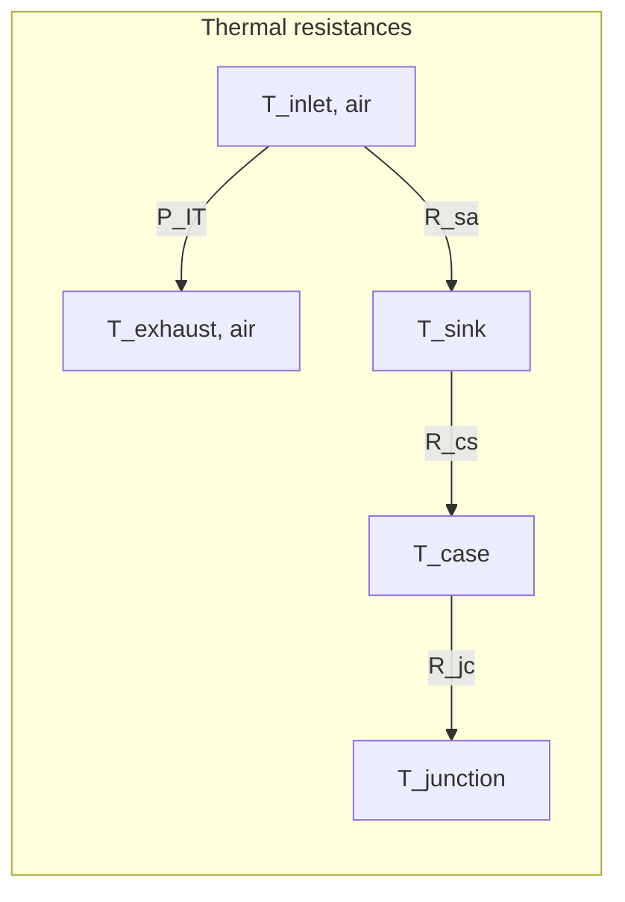

% ===========================================================================
\part{Presentation of the modules}
% ===========================================================================

When we face modelling choices we usually have two paradigms:

Model physically the sub-system your are studying
- requires exogenous standardized parameters
- work with assumption of ideality, physic models
- equations should be inceasingly complex to grasp real behavior of physical systems

Or use polynomial fitting of the behaviour of the sub-system.

- coefficients can give very reliable behaviour
- almost all behaviours can be reproduced by polynomial equations.
- computation is very quick (trivial multiplications and additions) 
- Highly dependent on a particular sub-system, coefficient should be recalibrated for each new sub-system.  
- Require time-series measures from a real system.
- Data should be clean, identifiable to a precise architecture and hardware models, coherent, without operating conditions or hardware changes. 

During my work in estimating flexibility capabilities of data centers via its cooling system through modelling , I faced some hardships:

- Data centers have multiple architectures depending on if they are air or liquid cooled, no standardized chain of cooling devices or hardware components for the severs, and different operating conditions in flow rates, redundancy, number of chillers, volumes of water, headrooms, etc.
- On the internet, there is no consistent time series data measurements. (cf. Part III "Data research")
- For parameters, specifications of real devices for cooling systems and servers are findable on the internet but are scarce.

Because of this the values of the model are presented wihin an interval. This interval can mean two very different this:
- variability between models. Becasue we don't know which systems are present in data centers, the statistical approach will replicate the variability of the different hardwares and thir sizes.
- variability during operation . This are the degrees of freedom the cooling system has, that allow flexibility and power consumtion reduction.

Structure:

We have modular blocs with functions independent of the other blocs and we have connexions between these blocs. The interface between two modules is composed of the flow rates and the temperatures. The sizing method of my modelling focuses on these interfaces. 

# Basic concepts

## Heat exchanger / NTU model

This modelling is found in thermal transfers inside : 
- the cooling tower
- crac units
- server

Each one of these systems have their own specificities, so equations are still different but stem from the same model.

# Flexibility parameters:

Reservoir

Flow rates no. 

# Chiller

The chiller is the main source of electricity consumption. It is a central piece of the cooling system using a refrigerant loop with: 
- a compressor, 
- an expansion valve 
- an evaporator
- a condenser

## Equations

### Water cooled
$
T_{evap, out} = T_{setpoint} $[1]

$Q_{demand} =  D_{evap} c_{p, w} \rho_w (T_{evap, in} - T_{evap, out} ) $

$PLR = \frac{Q_{demand}}{Q_{rated}} $

$EIR(PL) = a_0 + a_1 PLR + a_2 PLR^2 $

$COP_{ref} = COP(PLR = 1)$
$
COP = \frac{COP_{ref}}{EIR(PLR)} $[2]  \cite{COP_ASHRAE}
$
T_{cond, out} = T_{cond, in} + (1 + \frac{1}{COP})\frac{ D_{evap}}{ D_{cond}} ( T_{evap, in} - T_{evap, out} )$ [3]

### Air cooled 

$$
T_{evap, out} = T_{setpoint} 

T_{air, out} = T_{air, in} + (1 + \frac{1}{COP}) \frac{D_{evap} \rho_w c_{p, w}}{D_{outside, air}\rho_air c_{p, air}} ( T_{evap, in} - T_{evap, out} ) 
$$

## Assumptions
[1]
- Perfect setpoint tracking, control asssumption

[2]
- Single-chiller, no plant-level interaction effects (sequencing, staging losses between multiple chillers are not captured)
- Quasi-steady-state at each PLR — no transient/startup effects

[3]
- Steady-state energy balance — no thermal mass/capacitance in the chiller (no transient charging/discharging of refrigerant or metal mass).
- Both condenser and evaporator loop use pure water.
- the heat capacity and volumic mass of water are constant and don't depend on temperature.
- Hermetic water-cooled compressor : All compressor work ends up as heat rejected at the condenser
- No pumps heat addition, no piping heat gain/loss between chiller and measurement points.
- Chillers are working at their rated conditions
- No maximum cooling capacity

## Parameters

$
Q_{rated} # in tons 
COP_{ref}   # adim
(a_0, a_1, a_2) : empirical curve fitting parameters

D_{evap}
D_{cond}
T_{setpoint}

$

## Values for water cooled chillers

$
1 nominal ton of refrigeration = 3.517 kW cooling output
 COP = 3.517 / (kW/ton)
Q_{rated}  \in [150, 4000] tons = [530, 14100] kW \cite{AHRI_Directory}, \cite{FriendlyPower} (cf. Nominal cooling capacity)

Aquaforce model 30XW-V:
Q_{rated} \in [567, 1432] kW \cite{AQUAFORCE}

COP_{ref}  \in [0.54, 0.64] kW/ton => [5.5, 6.5] adim \cite{Trane_chiller_ex}, \cite{AQUAFORCE} (page 9), \cite{FriendlyPower} 

(0,1,0) \cite{EnergyPlus_COP}

 (0.171, 0.588, 0.237) \cite{COP_params}
 (0.223, 0.313, 0.464)
 (0.064, 0.585, 0.353)
$

These are considered the default parameters for a water cooled chiller

After more research, there is EnergyPlus with a bit less than 300 chiller models, air and water cooled collected over a 10-year period from 1991 to 2001. \cite{EnergyPlus_Git}

We can confirm good consistency between the default parameters and the statistical analysis of the EnergyPlus data for water-cooled chillers. However, the default interval of cooling capacity underestimates the maximum cooling capacity for a factor 4. 

Note: For my modelling, I erased two models (DOE...) because no reference_capacity_kW was specified (null).

### EnergyPlus data, statistical analyzis

### Characterisation of the EnergyPlus chiller dataset

Before using the chiller models for further analysis, the content of the EnergyPlus `Chillers.idf` dataset was examined in order to understand the range and nature of the equipment represented. The file contains a total of **273 chiller models**, of which **162 are water-cooled** and **111 are air-cooled**, corresponding to approximately 59% and 41% of the dataset, respectively. The following analysis considers the compressor technologies represented in each group, as well as the distributions of reference cooling capacity and reference coefficient of performance (COP).

#### Compressor technologies

The water-cooled chillers are dominated by **centrifugal compressors**, which account for **110 of the 162 models (67.9%)**. Screw compressors represent a substantially smaller fraction, with **21 models (13.0%)**, while only one reciprocating and one scroll chiller are present. For **29 water-cooled chillers (17.9%)**, the compressor type could not be identified from the available metadata and was therefore classified as unknown. This distribution indicates that the water-cooled portion of the dataset is primarily representative of centrifugal chiller technology, which is consistent with the larger cooling capacities typically associated with this type of equipment.

The air-cooled chillers exhibit a markedly different technological distribution. Of the **111 air-cooled models**, **92 (82.9%) use scroll compressors**, while the remaining **19 (17.1%) use screw compressors**. No centrifugal or reciprocating compressor models are represented in this subset. The distinction between the two groups is therefore quite pronounced: the air-cooled database is largely composed of scroll chillers, whereas the water-cooled database is dominated by centrifugal machines.

#### Reference cooling capacity

The reference cooling capacities also show a substantial difference between the two condenser types. For the water-cooled chillers, **160 models contain a valid reference cooling capacity**, with values ranging from **172.3 kW to 5651.3 kW**, giving an overall span of **5479 kW**. The models therefore cover equipment ranging from relatively small water-cooled units to multi-megawatt chillers. To assess how continuously this capacity range is represented, the capacities were sorted in ascending order and the differences between consecutive values were calculated. The largest gap is **854.5 kW**, occurring between **3165.0 kW** and **4019.5 kW**, corresponding respectively to the *McQuay PFH 3165 kW/6.48 COP/Vanes* and *McQuay PFH 4020 kW/7.35 COP/Vanes* models. Thus, although the water-cooled dataset covers a very broad capacity range, the representation becomes relatively sparse in some parts of the high-capacity region.

All **111 air-cooled chillers** contain valid capacity information. Their reference capacities range from **34.465 kW to 1609.4 kW**, corresponding to an overall span of approximately **1575 kW**. The largest interval between two consecutive capacities is considerably smaller than for the water-cooled chillers, at **151.5 kW**, between the **1348.0 kW Carrier 30XA400** and the **1499.5 kW Carrier 30XA450**. The air-cooled models therefore occupy a narrower and generally lower capacity range, while also providing a relatively denser coverage of that range.

#### Reference COP

The reference COP values further differentiate the two groups. For the **162 water-cooled chillers**, the reference COP ranges from **3.67 to 11.77**, resulting in a total span of **8.10**. After sorting the COP values, the largest gap between consecutive observations is **1.16**, between COP values of **10.61** and **11.77**. These values correspond to the *York YT 563 kW/10.61 COP/Vanes* and *Trane CVHF 2567 kW/11.77 COP/VSD* models. The broad COP range reflects the diversity of water-cooled equipment represented in the file, including different capacities, compressor technologies and capacity-control strategies.

By contrast, the COP values of the air-cooled chillers are concentrated within a much narrower interval. Across all **111 models**, the reference COP ranges from **2.61 to 3.17**, for a total span of only **0.56**. The largest gap between consecutive COP values is **0.13**, between **2.67 and 2.80**. Consequently, the air-cooled models form a relatively homogeneous group in terms of reference efficiency compared with the much wider variation observed among the water-cooled chillers.

#### Overall dataset coverage

Overall, this preliminary examination shows that `Chillers.idf` does not represent a uniform population of chillers. The air-cooled subset is primarily composed of scroll-compressor equipment, covers capacities from roughly **35 kW to 1.6 MW**, and exhibits a relatively narrow range of reference COP values. The water-cooled subset is considerably broader, both in capacity and performance, extending from approximately **170 kW to 5.7 MW** and being dominated by centrifugal compressors. Examining the minimum and maximum values together with the gaps between consecutive observations is particularly useful because it provides information not only on the nominal extent of the dataset, but also on how densely the different operating regions are represented. These characteristics should therefore be taken into account when selecting models from the EnergyPlus database or when using the dataset to construct a representative chiller population.

### Choice of parameters: 

Q_rated and COP_ref (full-load COP) are certified, published value under the standard:\cite{Standard_AHRI550}. Furthermore their situation reference is standardized in temperatures leaving and entering. 

Both numbers come from the exact same test and the exact same standard rating conditions : 44.00°F leaving and 54.00°F entering chilled-fluid temperatures, with 85.00°F entering and 94.30°F leaving condenser-fluid temperatures for water-cooled units. So Q_rated and COP_ref are a matched pair, both certified together, both published on the same spec sheet / AHRI certificate.

## Validity domain

[1]
- Only valid if T_evap,out actually reaches setpoint — under extreme load or insufficient capacity this fails silently (the equation will overstate cooling delivered).

[2]
- Only valid for PLR above 0.1-0.3 and below 1. If the PLR is too low the chiller cycles on/off rather than modulating. (DOE-2 style models)
- Only valid near rated/AHRI-standard temperature conditions

- Parameters spread from each other within [5.0, 6.2] for PLR above 40 percent. Below, the discrepancies increase.

[3]
- Only valid while the chiller is running and stable — not during startup, shutdown, or hot-gas bypass/unloading transients.

- The set of (Q_{rated}, COP_{ref}) parameters are taken for Centrifugal Chillers.
## Confidence interval

[2]
- On COP, for a given set of fitting parameters, the induced error is 10-15% at PLR > 50%, 20-25% at PLR < 50% 

[3]

$ 
\frac{\partial T_{cond,out}}{\partial COP} = −\frac{D_{evap}( T_{evap, in} - T_{evap, out} ) }{ D_{cond} COP^2} $

With COP carries a relative uncertainty $ \epsilon = \frac{\partial COP}{COP} $ we can then propagate the error to the temperature :

$ \delta T_{cond,out} = \epsilon \frac{D_{evap}( T_{evap, in} - T_{evap, out} ) }{ D_{cond} COP} $

With numerical values we get a maximum: $\delta T_{cond,out} = \pm 0.1 C$

# Interface Chiller - CRACs 

## Volume

### On WUE

WUe for Water usage efficency is a measyre that gives, flow rate of water consummed per W of It power. However the water consumed is mainly water evaporated no water cirulating in pipes in the cooling system. Main contrubitions to the WUe are the evaporation in the Cooling towers (2-3 % of the volume)
This data is not usefull for sizing the volume of water in a data center.

### Values

A rule of thumb to size the volume of the evaporator loop of the chiller is : 10 gallons per ton cooling Q_{rated} \cite{Redriver_tanks} ("The most widely used rule of thumb is 10 gallons per ton of installed chiller capacity")

## Flow rates

### Values: 
the standard measurement for a chiller is given by: "test conditions of 44°F (7°C) leaving chilled-water temperature and 2.4 gpm/ton evaporator fluid flow and 85°F (29°C) entering condenser water temperature with 3 gpm/ton (0.054 I/s • kW) condenser water flow " \cite{Standard_C403}

So taking the min and max of $ Q_{rated}$:

- $D_{evap,nominal} \in [23, 605] 
$L/s
- $D_{cond,nominal} \in [28, 756] $l/s

Which is coherent with: Operating range for Chiller \cite{AQUAFORCE} (page 9)
Here the variability depends on the model (30XW-V 160 to 400 with a perfect correlation between Capacity and flow rate).
$D_{evap} \in [24, 62] L/s
D_{cond} \in [30, 76] L/s
$
### Variability within a specific chiller. 
$
D_{evap} \in [0.40, 1] * D_{evap,nominal} \cite{Variable_FR}. I wasn t able to find an upper bound of the evaporator flow rate. So it is rasonable to leave it at 1. 

$
For a standard chiller, chilled water flow rate change should not exceed roughly 2% within any 10-minute window, to avoid destabilizing the compressor's surge-avoidance controls. \cite{Variable_FR}
Therefore, this makes the flow rate an almost fixed parameter. 

## Temperatures

### Values
operating range for Chiller \cite{AQUAFORCE} (page 3)
$
T_{evap, out} \in [3.3,20] C
T_{evap, in} \in [6.1,31.1] C (\Delta T_{evap} \in [2.8, 11.1] C)
T_{cond, out} \in [19,50] C
T_{cond, in} \in [16.2,38.9] C (\Delta T_{cond} \in [2.8, 11.1] C)
$

T_{setpoint} is for air-cooled facilities typically set at (42-44 F) = (6-7 C). However optimization push data centers to increase the setpoint temperature of the chilled water (10 C - 18 C). \cite{Uptime_cooling} (see: "Typical legacy data centers have chilled water set points between 42-45°F (6-7°C)")$

# Cooling Tower

$$\begin{cases}

k
\epsilon = \frac{T_{w, in} - T_{w, out}}{T_{w, in} - T_{wb}} \cite{Merkel} \\

\end{cases}$$

## Parameters

$
D_{outside, air} 
D_{cond}

\epsilon = \epsilon_{calibr}

T_{w, out, calibr}, T_{w, in, calibr}, T_{wb, calibr}

$

## Values
Normalized operating point for all documentations thanks to \cite{Standard_AHRI550}
"Nominal tons of cooling represents 3 GPM of water cooled from 95ºF to 85ºF at a 78ºF entering wet-bulb temperature" (page 1)
$
T_{w, out, calibr} = 85 F
T_{w, in, calibr} = 95 F = 35 C

T_{wb, calibr} = 78 F

D_{outside, air} \in  [62.8, 605] kCFM ([62.8, 302]  for single Cell and [126, 605] for Double Cell \cite{Series3000CoolingT} (pages 1-2))k

D_{outside, air} \in  [5.0,  291] kCFM  \cite{SeriesVCoolingT} (pages 1-6)

D_{outside, air} \in  [9.6,  995] kCFM \cite{Evapco} (page 3, 76) 

D_{cond, nom} = 3 * [12, 1330] GPM = [36, 4000] GPM =  \cite{SeriesVCoolingT} (pages 1-6)

D_{cond, nom} = 3 * [240, 2600] GPM = [720, 7800] GPM =  ([240, 1300] for single Cell and [480, 2600] for Double Cell \cite{Series3000CoolingT}
 )
D_{cond, nom} = 3 * [33, 5080] GPM = [99, 15160] GPM =  \cite{Evapco} (pages 1-6)

Summary :
D_{outside, air} \in  [5.0,  995] kCFM = [2.4, 470] m3/s
D_{cond, nom} \in  [36, 15160] GPM = [2.3, 957] L/s

Q_{nom} = 10 * 5/9 * 4.190 * D_{cond, nom}       # kW
Q_{nom} \in [53.5, 22.3 * 10 **3] kW

$

Cooling towers can take a wide range of different values (air flow rates, cooling capacity) because the number of cells can easily scale with the demand during cooling system sizing. We consider we can have an operating efficiency = nominal efficiency independenlty of condenser flow rate.
## Assumptions

-   Counterflow configuration.
-   Lewis number = 1 (heat and mass transfer analogy holds — same assumption as Merkel).
-   The enthalpy driving force is treated exactly like a temperature driving force in a conventional sensible heat exchanger — i.e., the "air-side capacity rate" is replaced by G⋅CsG \\cdot C\_s G⋅Cs​ rather than G⋅cpaG \\cdot c\_{pa} G⋅cpa​.
-   C_s​ (and therefore m^* ) is constant over the exchanger — approximated via a linearization of the true (curved) saturation enthalpy line between inlet and outlet water conditions.
-   Steady-state, no wall/casing heat losses, uniform air and water distribution across the fill cross-section.
- Because we are staying close to the operating point that depends on both air and water flows we assume that the Cooling tower works near its rated flow rates.
- We study steady-state operation, no transient storgae effects.
- Dry air and water vapor are each treated as ideal gases (Dalton's law of partial pressures for the mixture) 
- Heat capacity for water vaoupr is supposed to be constant.
- h_{fg​} is referenced to 0°C and treated as behaving linearly with the c_{pv}(T).
- [5] empirical curve, standard atmospheric composition at sea level.

## Method
$

The standard modus operandi for Cooling Tower constructors is to give one operating point (T_{w, out, calibr}, T_{w, in, calibr}, T_{wb, calibr}) and specify the airflow coming inside the cooling tower D_{outside, air}.

First we find \epsilon and  m*(T_{operatingPoint}) using formulas for C_s(T_{operatingPoint}) then D_{cond} and the given D_{outside, air}. Then we compute NTU_{calibr} = \frac{ln(\frac{1−ε}{1−m∗ε}​)​}{m∗−1}.

And we have the function \epsilon_{calibr}(T_{wb} ) 

From this we can now compute T_{w, out} using this : 

T_{w, out} = T_{wb} - \epsilon_{calibr}( T_{w, in} - T_{wb} ) 

With \epsilon_{calibr} independent of flow rates (assumption) and dependent of T_{wb} and T_{w, out}. 

\epsilon contains a non closed-form since C_s(T_{w, in}, T_{w, out}) depends on T_{w, out}. We can either do a loop for convergence or use the T_{w, out} at time t - dt. To reduce complexity the second option will be prefered.

$

# Interface CoolingT - Chiller

## Sizing

$ Q_{coolingCapacity}^{CoolingT} = (1+ \frac{1}{COP(PLR = 1)})* Q_{coolingCapacity}^{Chiller} $

Be carefull that the nominal tons are defined differently for Cooling towers and Chillers: 3 GPM cooled 10°F of water versus 2.4 GPM GPM cooled 10°F of water.

# OutdoorEnvironment

The outdoor environment is an essential component in the model that allows exhaustion. 

This class has two attributes: the dry-bulb temperature $T_{db}$ in degrees Celsius, and a relative humidity $ RH$ in percentage to compute the wet-bulb temperature $T_{wb}$ in degrees Celsius.

##  wet-bulb temperature
Finding the wet-bulb temperature is non trivial. \cite{ASHRAE_handbook}

In fact, wet-bulb temperature is found by equalizing the Humidity ratio from vapor pressure and the implicit dry-bulb / wet-bulb relationship. Because the Humidity ratio depends nonlinearly on $ T_wb$ (via the saturation vapor pressure curve, e.g. Hyland-Wexler), we need to iterate on these equations until convergence.

Its main equation \cite{Stull} is:

$$
        T_{wb} = T_{db} arctan(0.151977 \sqrt{RH + 8.313659}
               + arctan(T_{db} + RH)
               - arctan(RH - 1.676331)
               + 0.00391838 (RH)^{1.5}arctan(0.023101 RH)
               - 4.686035)
$$

arctan() function uses argument values in radians. 

### Choice of the equation

This equation is an empirical fit from an original psychrometric graph giving $ T_{wb} $ from $T_{wb}$ and relative humidity at standardized pressure (sea level) $P = 101.325 kPa $. 

The choice of this empirical expression stands for three reasons: 
\begin{itemize}
\item The only inputs of this expression are RH and $ T_{db}$ which are highly accessible and standardized data collected by any cooling system. 
\item The vast majority of Data center in Australia are located in latitudes with temperatures within the interval - 20 C and 50 C, and altitudes relatively close to sea level (Sydney, Melbourne). So the sea-level pressure is consistent with the scope of this work.
\item The output temperatures of this equation are very good approximations of the exact temperature, enough for our use in the Cooling Tower equation. With a fixed confidence interval of $[- 1 C; 0.65 C] $, and mean absolute error of less than 0.3 C.
\end{itemize}

Despite of the posibility to use an exact psychrometric inversion equation derived from physics models, or read psychrometric tables for given pressures, we prefer the simplified Stull model because these methods require the pressure (or altitude) at the Data Center location as another input which adds complexity to the model, and require a heavier code with dozens of iterations at each timestamp to approximate $ T_{wb}$ .

### Parameters justification and confidence interval

Parameters were given in the paper \cite{Stull} .

According to it, the output $T_{wb}$ for our model can be in the confidence interval: $ [ T_{wb} - 1 ; T_{wb} + 0.65 ]$ degrees Celsius.

### Validity

According to the abstract of the paper: "This equation is valid for relative humidity between 0.05 and 0.99 and for air temperatures between - 20 C and 50 C, except for situations having both low humidity and cold temperature. Over the valid range, errors in wet-bulb temperature range from - 1 C to 0.65 C, with mean absolute error of less than 0.3 C." \cite{Stull} 

The Stull equation is "not based on physical principles."(2. Empirical expression for wet-bulb temperature) \cite{Stull} and is only valid for pressure at sea level. 

Therefore, if the model is estimating flexibility for a Data Center at a given altitude $\Delta h_{DataCenter}$, the pressure can make the wet-bulb temperature vary more than the previously mentionned confidence interval. It is then important to evaluate the discrepancy between Stull's simplified model and the exact equation.

Using the Barometric Formula "valid from sea level to 86 km altitude" to link altitude and pressure :

$$
p = P_0 \left[ \frac{T_0}{T_0 + L \Delta h_{DataCenter}} \right] ^{\frac{gM}{RL}}
$$

Where:

$p$ = air pressure at altitude 
$p_0$ = air pressure at sea level (approximately 101325 Pa)
$L$ = temperature lapse rate (approximately 0.0065 K/m in the troposphere)
$T_0$ = standard temperature at sea level (approximately 288.15 K)
$g$ = acceleration due to gravity (approximately 9.80665 m/s²)
$M$ = molar mass of Earth's air (approximately 0.0289644 kg/mol)
$R$ = universal gas constant (approximately 8.31432 J/(mol·K))
$\Delta h_{DataCenter}$ = altitude of Data Center above sea level in meters

\cite{Barometric_formula}

Then, compute the exact equation of $T_{wb}(p)$ with the dynamic non closing algorithm and compare it to $T_{wb}(P_0)$. Either increase the confidence interval accordingly or use directly the physical equation. 

# CRAC Unit

For CRAC units, there si no rated point or cooling capacity designed. Works with a room controller. Specs usually give several operating points. Unlike chillers, CRACs have very broad operating conditions. We decide not to model the variations of water flow rates and air flows. We assume effectiveness is constant through the considered period, and we compute the effectiveness using the statistical approach: monte carlo.
$$

C_i = \rho_{i} c_{p, i} D_i

C_{min} = min(C_{w}, C_{air} ) = C_{air}

C_r = \frac{C_{air}}{C_{water}}

PowerTransfered = C_{min} \epsilon ( T_{hot, in} - T_{cold, in} ) \cite{arxiv_eq} [2]

\epsilon_{op} = \frac{Q_{op}}{C_{air,op}(T_{air, in, op} - T_{w, in, op}) }

T_{air, out} = T_{air, in} - PowerTransfered / C_{air}

T_{water, out} = T_{water, in} + PowerTransfered / C_{water}

$$
## Parameters

$
Q_{op}
D_{air,op}
T_{air, in, op} 
T_{w, in, op}
$

## Values

$ \epsilon_{op} \in [0.65 , 0.90]$

In fact, We compute : 

$\epsilon = \frac{Q_{op}}{C_{air,op}(T_{air, in, op} - T_{w, in, op}) }$

Model 305, 375, 415 \cite{Vertiv_HE} (pages 9-14)
$

(Q_{op},D_{air,op} , T_{air, in, op}, T_{w, in, op}) = 
P 9
 Model 305
(228, 16.5, 23.9, 7.2)
(276, 16.5, 26.7, 7.2)
(323, 16.5, 29.4, 7.2)
 Model 375
(267, 16.5, 23.9, 7.2)
(319, 16.5, 26.7, 7.2)
(370, 16.5, 29.4, 7.2)
 Model 415
(288, 16.5, 23.9, 7.2)
(341, 16.5, 26.7, 7.2)
(394, 16.5, 29.4, 7.2)
\epsilon \in [0.69, 0.90]
P 10
 Model 305
(214, 16.5, 23.9, 7.2)
(263, 16.5, 26.7, 7.2)
(311, 16.5, 29.4, 7.2)
 Model 375
(258, 16.5, 23.9, 7.2)
(311, 16.5, 26.7, 7.2)
(362, 16.5, 29.4, 7.2)
 Model 415
(279, 16.5, 23.9, 7.2)
(334, 16.5, 26.7, 7.2)
(387, 16.5, 29.4, 7.2)
\epsilon \in [0.65, 0.88]
P 11
 Model 305
(235, 17.2, 23.9, 7.2)
(285, 17.2, 26.7, 7.2)
(334, 17.2, 29.4, 7.2)
 Model 375
(276, 17.2, 23.9, 7.2)
(331, 17.2, 26.7, 7.2)
(384, 17.2, 29.4, 7.2)
 Model 415
(299, 17.2, 23.9, 7.2)
(355, 17.2, 26.7, 7.2)
(409, 17.2, 29.4, 7.2)
\epsilon \in [0.68, 0.89]

Summary : \epsilon \in [0.65, 0.90]

Q_{op} \in [214, 455] kW
D_{air,op} \in [35, 42] kACFM= [16.5,19.8] m^3 / s

T_{air, in, op} \in [23.9, 29.4] C
T_{w, in, op} \in 7.2 C
$

with glycol: \cite{STULZ_HE} (pages 12, 15)
$

Q_{op} \in [295, 900] kW
D_{air,op} \in [24, 90] kACFM= [11.3,42.5] m^3 / s

T_{air, in, op} \in [23.9, 34.9] C
T_{w, in, op} \in 7.2 C
$

For the link between Q_{op} and D_{air,op} is given as a rule of thumb : 350-500 CFM / ton_evap  \cite{CRAC_airflow}

this ratio matches the above values.

### Usefull Value:

$D_{water, op} \in [8, 24] L/s \cite{Vertex_HE} (pages 9-14)$

$D_{water, op} \in [6.5, 23] L/s for 6 out of the 10 models,  but extreme bounds are: [3, 48] L/s \cite{STULZ_HE} (pages 12, 15) $ 

## Assumptions
- dry coil assumption : only sensible heat transfer, no condensation dehumidifaction of the air.
- constant specific heats over the range of temperatures involved
- Counter-flow coil
- no heat loss to ambient air
- Uniform, well-mixed inlet temperatures at each port (no stratification at the coil face)
- No fan/pump motor heat pickup is included in the air-side enthalpy rise

- No significant variation of the air flow rate. Working state close to the nominal conditions. 

- Because of the difference of cooling capacity between air and water, $\frac{c_{p, air} \rho_{air}}{c_{p, w} \rho_w} \sim 8. 10^{-4} $ we assume that the limiting cooling capacity is the air. $C_{min} = C_{air}$

- For parameters, the air flow rate is given in ACFM (Actual cubic feet per minute) \cite{Wiki_ACFM} not in Standard CFM. We assume that air density does not vary significantly with the pressure difference.
## Method

To find $ \epsilon$ two methods are possible, the most precise is using the NTU Method, because $\epsilon$ can be computed taking into account the air flow. However this requires having $ UA $ coefficients that are not standardized. Moreover, because the is not meant to vary, the $\epsilon$ will be taken as a constant only dependent on the nominal working state of the Heat exchanger. 
## Validity domain

The equation [2] is not valid for all air flow rates. Since the \epsilon has been taken for nominal conditions, the air flow rate should stay close to the rated flow rate.

# Interface Server - CRAC

Assumption that we use the Containment aisles architecture.

## Inlet temperature 

It is a common practice that T_{inlet} = 24 C \cite{Uptime_cooling} ("Current practices permit most computer rooms to use 75°F/24°C supply in the Cold Aisle")

# Server

## Architecture of the server

The CPU is composed of several components, all used for optimizing thermal power. 

The CPU die (in silicon) is in contact, thanks to a thin layer of metal (Thermal interface material, TIM), with a case (mainly made of Copper) also called an Integrated Heat Spreader, IHS. The case is then in contact with the heatsink, that will dissipate the heat through its fins when the airflow goes through it. \cite{IHS_IEEE}

In this system, the following technical vocabulary was followed: 
- T_junction for the temperature of the CPU die, the one we want to control and keep below a certain level for flexibility.
- T_case for the temperature of the IHS.
- T_heatsink
- T_air, inlet, is the air surrounding the heatsink, that is hotter than the air in the cold aisle. 

Equations for dynamics and time scale:
Note in these equation: "CPU" contains the die and the case with a resistance R_js = R_jc + R_cs
$$\begin{cases}

\frac{dT_{CPU}}{dt} = - \frac{T_{CPU}}{R_{js}C_{CPU}} +\frac{T_{HS}}{R_{js}C_{CPU}} + \frac{P_{IT}}{C_{CPU}} \\
 
\frac{dT_{HS}}{dt} = - T_{HS} ( \frac{1}{R_{js} C_{HS}} + \frac{1}{R_{sa} C_{HS}} )  + \frac{T_{CPU}}{R_{js} C_{HS}} +  \frac{T_{inlet}}{R_{sa} C_{HS}} \\

\epsilon_{HS} = 1 - \exp(- \frac{1}{R_{sa} * \rho_{air} D_{air} c_p,air}) \\
  
T_{out} = T_{inlet} + \epsilon_{HS} ( T_{HS} - T_{inlet} )

 
\end{cases} $$

In steady State:
Final equations \cite{IHS_IEEE} :
$$ \begin{cases}
T_{junction} - T_{case} = P_{IT} R_{jc}\\
T_{case} - T_{sink} = P_{IT} R_{cs}\\

T_{sink} - T_{air, inlet} = P_{IT} R_{sa}\\
P_{IT} = C_{air}* (T_{air, exhaust} - T_{air, inlet}) 

\end{cases}
T_{junction} = T_{air, inlet} + P_{IT}* (R_{jc}+ R_{cs}+ R_{sa})

\cite{arxiv_CPU_eq} (page 20, Eq. 20)

$$

## Parameters

$
D_{HS, air}
R_{jc}
R_{cs}
R_{sa}

$

## Values
$
The industry don't use R but \Psi notations. Intel defines \Psi_{CA}, \Psi_{cs} and \Psi_{jc}\dots
Here si a clear illustration fo all those variables \cite{Intel_Xeon_doc} (Fig. 4-2 page 36)
$
### R_jc
$The resistance between junction and case increases depending on the number of cores running. Interestingly the resistance is higher for low utilization because the case temperature stays almost constantly at 70 degrees \cite{INTEL_T_jc}. From this patent, we get an estimation of \Psi_{jc} for different core utilisation. For the sake of simplicity, we will just focus on the interval \Psi_{jc} can cover:

\Psi_{jc} \in [0.1, 0.28] C / W \cite{INTEL_T_jc} (page 5/8)
$
### R_cs
$
R_{cs} is mainly due to the TIM between the case and the heatsink. Intel uses Honeywell PCM45F as a Thermally conductive phase change material (PCM) for all its chips. I didn't find documentation on \Psi_{cs} for CPU dies but for C620 chipset, that are PCH. The following value is a correct approximation of the TIM resistance for a CPU. For more complexity, we can also take the material resistance and multiply by the area of the IHS.  
\Psi_{cs} \in [0.1, 0.187] C /W \cite{altera_Rcs} , \cite{Intel_C620_2017} (page 25)
$

### R_sa
$
With 
\Psi_{CA}( D_{air}) =  \Psi_{cs} + \Psi_{sa}( D_{air}) \cite{Intel_Thermal_guide}
We can easily compute R_sa, since it is not given alone.

\Psi_{CA}( D_{HS, air})  = { (0.185, 36), ( 0.295, 12.6), (0.210, 28) } (C/W, CFM) \cite{Intel_Xeon_doc} (page 29, 31)

With curve interpolation: 
\Psi_{CA}( CFM) = 0.1431 + 1.9451*CFM^{-1.0719} for CFM \in [10, 100] CFM \cite{Intel_Xeon_doc}

\Psi_{CA}( D_{air})  = { (0.508, 19), ( 0.342, 29), (0.233, 69) } (C/W, CFM) Here the CFM is given by " estimating airflow exiting the information handling system". \cite{Dell_patent} So in practice D_{HS, air} = r* D_{air}, r \leq 1 $

The source already mentionned \cite{INTEL_T_jc} (page 5) gives also \Psi_{CA} \in [0.197, 0.208] C/W
### D_HS
Depending on the available volume inside the blade, and so the heatsink size:
$
D_{HS, air} \in  \begin{cases}
12.6 CFM: 1U\\
28 CFM: 2U\\
36 CFM: 4U\\
\end{cases}
$

### Usefull values
$
- Share of CPu models among Data Centers: \cite{Market_share_CPU}

AMD EPYC: 27%
ARM (Graviton/Grace/Axion/Ampere): 18 %
Intel Xeon: 55%
- T_{CPU, THERMTRIP} \in [115, 120] \cite{conversation_CPU_shutdown} \cite{Defs_Tjmax}
- T_{CPU, TJmax} \in [85, 95] \cite{conversation_CPU_shutdown}
- tdp_{CPU} \in [95, 130] W \cite{Intel_Xeon_doc} (page 29)
$

## Method

- The set of equations with the capacitances for dynamic behaviour help to find time constants and assert the granularity of the dataset for the cooling system is adapted to the IT steady state.

- To find the two resistances, I decided to look for available documentation : \Psi and \R_{CA} is a standard value for all CPU constructors.
- $ \Psi_{CA}(CFM)$ is dependent on the fans airflow. The values in CFM are taken as the entering flow in the Heatsink not in the whole blade. Because of the lack of precision from the inlet airflow for Dell, the value refernce will be that of Intel. 

- No information of thermal design for AMD found on the internet. 

- There is three different temperature for the CPU thermal system:  the junction (the actual silicon die temperature) which is the hottest point, inaccessible to external sensors, only estimated via the on-die Die Top System, the case (CPU package), that is the one all datasheets/thermal profiles specify limits for it and the heat sink. Between this three-elements chain there is a thermal resistance: $R_{jc},R_{cs},R_{sa}$. For simplicity, I take $R_{jc} = 0$ and $T_{CPU}$ is the temperature of both junction and case. 

- There is no findable study that estimates both $R_{js},R_{sa}$ for a real hardware. Uually the $R_{sa}$ is evaluated or modelled by a fluid study focusing only on the heatsink, and the $ R_{js}$ is evaluated using a chip alone, controlling the pressure of the case on the junction (without heatsink) because pressure is an important factor that enhances the $ R_{js}$. Therefore the values found for this resistances are taken for two different hardwares in two different configurations. The $R_{js}$ is taken for an Intel C620 Series Chipset: a Platform Controller Hub (PCH) designed for Intel Xeon Scalable processors no longer in production since 2018, and the $R_{sa}$ curve is taken from CPUs: Intel® Xeon® Processor7500 Series (launched in 2010) and Intel® Xeon® Processor E7 8800/4800/2800 Product Families (launched in 2011). For this reason it is not completely accurate to use them together.  

## Assumptions

- The propagation of the heat is assumed to be 1D. We don't take into account leaks through the socket/PCB/other parallel paths. That's the standard Intel \Psi_{ca} convention too \cite{INTEL_T_jc}

- steady-State: Temperatures set their equilibrium in a small time in comparison to the cooling system.

- Parameters: Even if the performance/efficiency of CPU chips has increased a lot, we assume that the thermal resistances from 2010 are still good estimations of the current thermal resistances.

- In practice the cold air that goes through the server is heated by the hot metal. Page 29 of the already cited document \cite{Intel_Xeon_doc}, there is T_{LA} = T_{ambient} + 7-10 C ( LA = "Local ambient temperature of the air entering the heatsink") For the moment, we take delta_T_{server} = 8 C

Structural uncertainty : 
- Spreading resistance (1D → real footprint)	+5 to +20 °C	
- Non-uniform floorplan power density (lumped avg → local hotspot)	+10 to +20 °C	

These are the most problematic blind spots of my thermodynamical model. I can predict flexibility. Find that the T_j is under the threshold and in fact it is not.

# Liquid cooled server

https://www.datacenterdynamics.com/en/analysis/hot-water-cold-water/

for heatsink liquid/liquid : 
 ε = 0.65 (CDU-HTW) and ε = 0.75 (HTW-CTW) " The clearest directly-citable data-center example I found: a recent HPC cooling digital-twin paper models CDU-to-HTW and HTW-to-CTW heat exchangers with nominal effectiveness values of ε = 0.65 (CDU-HTW) and ε = 0.75 (HTW-CTW), stated as consistent with the temperature profiles observed in real operational data (the Frontier supercomputer's cooling system)."

# Inputs :

This data are updated at each step of the simulation.

# Sizing ideas

## Methodology
$
With 
P_{max} = \sum_{i= 1}^{NSERVERS} P_{tdp}(model_{i})$
Because tdp are sized depending on the heatsink capacity (i. e. volume and corresponding air flow). We assume air flow adapted to the hatsink and we can indefferently take one of the three values because the values given in the table p29 \cite{Intel_Xeon_doc} are designed around T_junction and its limit T_TJmax.

## Assumption
- If we don't know the variability (standard deviation) of the size_in_kW of the data center. We assume completely aribtrarily, that : 
$
P_{\mu} = 0.8 P_{max}
$ 
- We assume that all CRACs of a given data center come from the same model. 
- We assume that N_CRAC_UNITS is minimized for a given data center so long as the corresponding cooling capacity matches that of the chiller. It is justified since our model don't take into account air displacement and heat distribution across the room.
- We use a rule of thumb for sizing the CRAC airflow to the 
- Oversizing or Redundancy are options. 
- We assume that PUE has its main contributions from the cooling system. And that the power of cooling system is mainly caused by the chiller
Thus, we can write : $ PUE = 1 + \frac{1}{COP_{avg}}$

- For the thermal_resistances, we take \Psi_{ca} in the worst case scenario. So we over value security, reduce flexibility.
the cooling system must be sized such that the CPU temperatures are equal to their $T_{CPU, TJmax}$
# For latex

\printbibliography